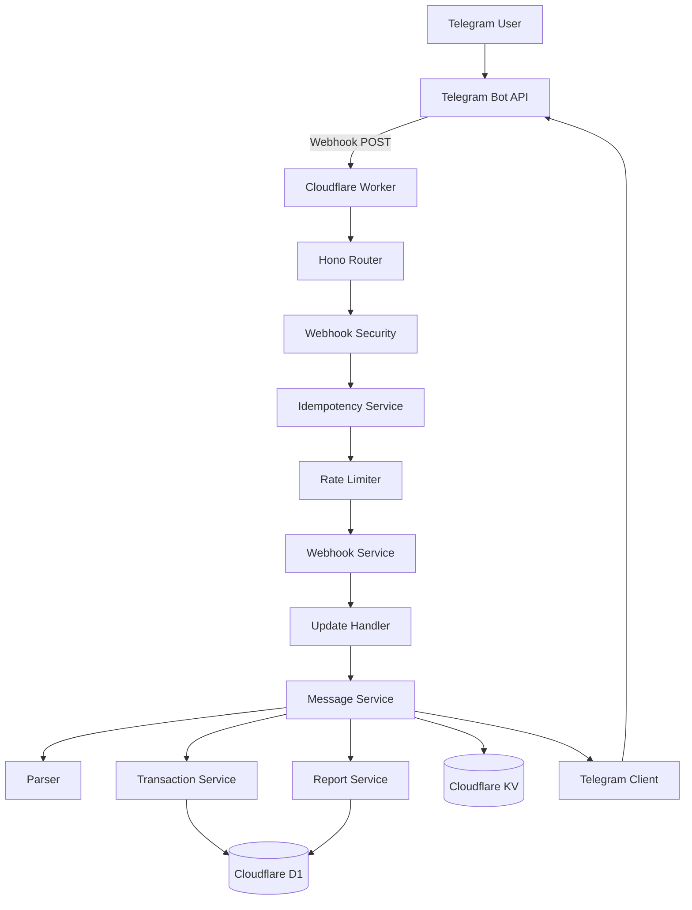
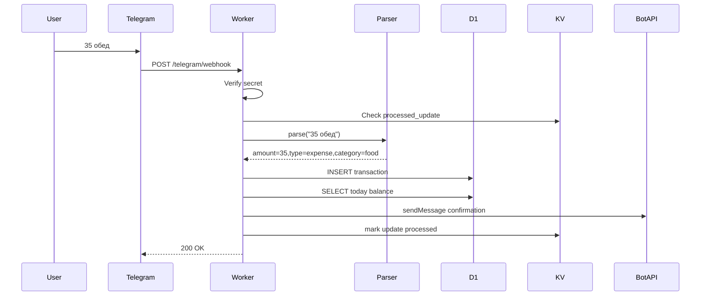
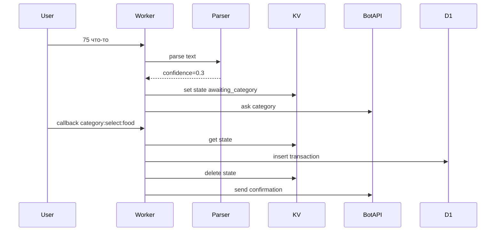
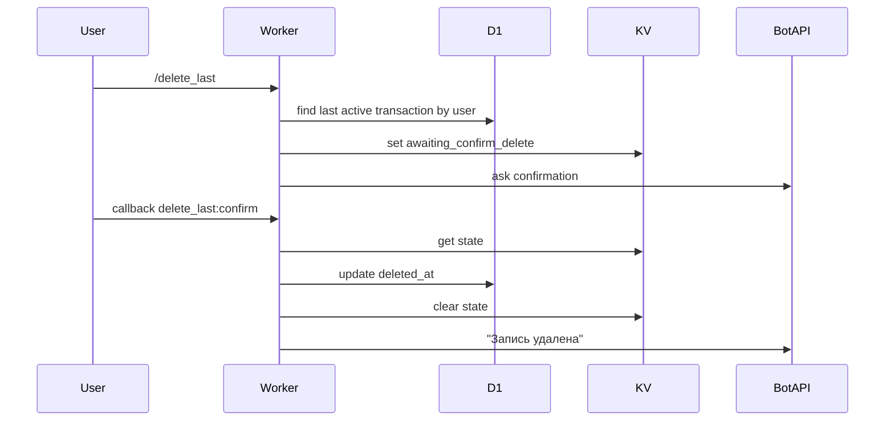

# 04_architecture.md — Архитектура Finance Telegram Bot

**Версия:** 1.0
**Дата:** 04.06.2026
**Статус:** Draft
**Проект:** Finance Telegram Bot
**Основной стек:** TypeScript, Cloudflare Workers, Hono, Cloudflare D1, Drizzle ORM, Cloudflare KV, Telegram Bot API, Zod, Vitest, Wrangler

---

## Содержание

1. Назначение документа
2. Краткое описание системы
3. Архитектурные цели
4. Архитектурные принципы
5. Общая схема системы
6. Основные runtime-компоненты
7. Backend-модули
8. Поток обработки Telegram webhook
9. Поток обработки обычного сообщения
10. Поток обработки команды
11. Поток обработки callback query
12. Поток создания транзакции
13. Поток уточнения категории
14. Поток удаления последней транзакции
15. Поток формирования отчётов
16. Cron architecture
17. Управление состояниями пользователя
18. Идемпотентность webhook
19. Rate limiting
20. Работа с базой данных
21. Soft delete architecture
22. Ошибки и отказоустойчивость
23. Безопасность на уровне архитектуры
24. Границы слоёв
25. TypeScript-контракты
26. Рекомендуемая структура файлов
27. Mermaid-схемы
28. Архитектурные решения и trade-offs
29. Что не делать в архитектуре
30. Чеклист готовности архитектурного блока

---

## 1. Назначение документа

Этот документ описывает архитектуру проекта **Finance Telegram Bot**.

Цель документа — объяснить, как система должна быть устроена технически:

* какие компоненты есть в системе;
* как Telegram webhook попадает в backend;
* как backend обрабатывает сообщения пользователя;
* где хранится постоянное состояние;
* где хранится временное состояние;
* как работает идемпотентность;
* как работает управление состояниями диалога;
* как строятся отчёты;
* как обрабатываются ошибки;
* какие границы должны быть между слоями;
* как не допустить смешивания бизнес-логики, SQL и Telegram API.

Документ самодостаточный. Junior-разработчик должен иметь возможность реализовать архитектурный каркас проекта, используя только этот документ.

---

## 2. Краткое описание системы

**Finance Telegram Bot** — это Telegram-бот для личного финансового учёта.

Пользователь пишет боту:

```text
35 обед
```

Система должна:

1. принять Telegram update через webhook;
2. проверить секрет webhook;
3. проверить, не был ли update уже обработан;
4. применить rate limiting;
5. найти или создать пользователя;
6. проверить временное состояние пользователя;
7. понять, это команда, callback или обычное сообщение;
8. распарсить сообщение;
9. сохранить финансовую операцию;
10. сформировать ответ;
11. отправить ответ через Telegram Bot API;
12. вернуть Telegram HTTP `200 OK`.

Главная архитектурная идея:

```text
Cloudflare Worker принимает webhook,
но бизнес-логика живёт в отдельных сервисах,
а финансовые данные хранятся только в D1.
```

---

## 3. Архитектурные цели

### 3.1 Быстрая обработка webhook

Цель:

```text
Webhook response < 1 second for normal messages
```

Это значит:

* не выполнять тяжёлую аналитику в webhook path;
* не делать лишние запросы в D1;
* не блокировать обработку долгими внешними API calls;
* Telegram API calls должны иметь timeout/retry policy.

---

### 3.2 Надёжное сохранение финансовых операций

Финансовая операция не должна:

* дублироваться;
* теряться после успешного сохранения;
* попадать к другому пользователю;
* учитываться после soft delete.

---

### 3.3 Простая расширяемость

Архитектура должна позволять добавить позже:

* бюджеты;
* долги;
* пользовательские категории;
* dashboard API;
* Excel export;
* OCR чеков;
* AI-категоризацию;
* семейный режим.

Для этого код делится на модули:

```text
users
transactions
categories
parser
reports
reminders
export
debts
budgets
```

---

### 3.4 Изоляция данных

Все данные пользователя фильтруются по `user_id`.

Архитектурное правило:

```text
Ни один repository method не должен читать финансовые данные без userId.
```

---

### 3.5 Минимальная инфраструктура

MVP не использует:

* VPS;
* Docker;
* PostgreSQL;
* Redis;
* Celery;
* Kubernetes;
* отдельный backend-сервер.

Вместо этого используются:

* Cloudflare Workers;
* Cloudflare D1;
* Cloudflare KV;
* Cloudflare Cron Triggers.

---

## 4. Архитектурные принципы

### 4.1 Telegram-first

В MVP главный интерфейс — Telegram.

Dashboard не нужен для базового сценария. Пользователь должен иметь возможность:

* добавлять расходы;
* добавлять доходы;
* смотреть отчёты;
* удалять последнюю запись;
* экспортировать CSV;

полностью через Telegram.

---

### 4.2 Thin routes, fat services

Route handler должен быть тонким.

Route handler отвечает за:

* HTTP request;
* validation;
* вызов service;
* HTTP response.

Route handler не должен:

* парсить финансовые сообщения;
* писать SQL;
* считать отчёты;
* напрямую строить сложный Telegram UX.

Плохо:

```typescript
telegramRouter.post('/webhook', async (c) => {
  const body = await c.req.json();

  // 300 строк логики:
  // проверка секрета, парсер, SQL, отчёты, Telegram response
});
```

Правильно:

```typescript
telegramRouter.post('/webhook', async (c) => {
  const result = await webhookController.handle(c);
  return result.toResponse();
});
```

---

### 4.3 D1 is source of truth

D1 — источник истины для постоянных данных:

* users;
* categories;
* transactions;
* category_rules;
* reminders;
* budgets;
* debts.

KV не является источником истины для финансовых данных.

---

### 4.4 KV only for temporary data

KV используется только для временных данных:

* `state:{telegram_id}`;
* `processed_update:{update_id}`;
* `rate_limit:{telegram_id}:{minute}`;
* `callback:{callback_id}`;
* temporary dashboard login token в версии 2.0.

---

### 4.5 Parser is pure

Parser не должен:

* обращаться в D1;
* отправлять Telegram-сообщения;
* менять состояние;
* создавать транзакции.

Parser принимает текст и контекст, возвращает структурированный результат.

```typescript
const parsed = parser.parse('35 обед', context);
```

---

### 4.6 Repository owns SQL

SQL и Drizzle-запросы должны находиться в repository layer.

Service layer вызывает методы:

```typescript
transactionRepository.create(...)
transactionRepository.findRecentByUserId(...)
reportRepository.getSummaryByPeriod(...)
```

Service layer не должен напрямую писать SQL.

---

### 4.7 Every user-scoped operation requires userId

Все операции с пользовательскими данными должны принимать `userId`.

Правильно:

```typescript
await transactionRepository.findRecentByUserId(userId, 10);
```

Неправильно:

```typescript
await transactionRepository.findRecent(10);
```

---

## 5. Общая схема системы

```text
┌──────────────────┐
│  Telegram User   │
└────────┬─────────┘
         │ message / command / callback
         ▼
┌──────────────────┐
│ Telegram Bot API │
└────────┬─────────┘
         │ HTTPS POST webhook
         ▼
┌─────────────────────────────────────┐
│        Cloudflare Worker             │
│                                     │
│  ┌───────────────────────────────┐  │
│  │ Hono Router                    │  │
│  └───────────────┬───────────────┘  │
│                  ▼                  │
│  ┌───────────────────────────────┐  │
│  │ Webhook Security Middleware    │  │
│  └───────────────┬───────────────┘  │
│                  ▼                  │
│  ┌───────────────────────────────┐  │
│  │ Idempotency + Rate Limiting    │  │
│  └───────────────┬───────────────┘  │
│                  ▼                  │
│  ┌───────────────────────────────┐  │
│  │ WebhookService                 │  │
│  └───────────────┬───────────────┘  │
│                  ▼                  │
│  ┌───────────────────────────────┐  │
│  │ Application Services           │  │
│  │ users / parser / transactions  │  │
│  │ reports / categories / export  │  │
│  └───────────────┬───────────────┘  │
└──────────────────┼──────────────────┘
                   │
       ┌───────────┴───────────┐
       ▼                       ▼
┌──────────────┐        ┌──────────────┐
│ Cloudflare D1 │        │ Cloudflare KV │
│ source of     │        │ temporary     │
│ truth         │        │ state         │
└──────────────┘        └──────────────┘
       │
       ▼
┌──────────────────┐
│ Telegram Bot API │
│ sendMessage      │
└──────────────────┘
```

---

## 6. Основные runtime-компоненты

### 6.1 Cloudflare Worker

Главный backend runtime.

Обрабатывает:

* `POST /telegram/webhook`;
* `GET /health`;
* future dashboard API;
* scheduled events.

---

### 6.2 Hono Router

Отвечает за HTTP-маршрутизацию:

```text
GET  /health
POST /telegram/webhook
GET  /api/reports/month       version 2.0
GET  /api/export/csv          version 2.0
```

---

### 6.3 Cloudflare D1

Постоянное SQL-хранилище.

Хранит:

```text
users
categories
transactions
category_rules
reminders
budgets
debts
```

---

### 6.4 Cloudflare KV

Временное key-value хранилище.

Хранит:

```text
state:{telegram_id}
processed_update:{update_id}
rate_limit:{telegram_id}:{minute}
```

---

### 6.5 Telegram Bot API Client

Обёртка над Telegram Bot API.

Используется для:

* `sendMessage`;
* `editMessageText`;
* `answerCallbackQuery`;
* `sendDocument`;
* `setMyCommands`.

---

### 6.6 Cron Trigger

Запускает scheduled handler.

Используется для:

* ежедневных напоминаний;
* weekly reports в версии 1.1;
* monthly reports в версии 1.1;
* cleanup задач в будущих версиях.

---

## 7. Backend-модули

Рекомендуемые модули:

```text
src/modules/
├── users/
├── transactions/
├── categories/
├── parser/
├── reports/
├── reminders/
├── export/
├── budgets/       version 1.1
├── debts/         version 1.1
├── dashboard/     version 2.0
└── ai/            version 3.0
```

---

### 7.1 users

Ответственность:

* найти пользователя по `telegram_id`;
* создать пользователя при первом `/start`;
* обновить profile metadata;
* хранить currency, timezone, language.

Главный service:

```typescript
UserService
```

Главный repository:

```typescript
UserRepository
```

---

### 7.2 transactions

Ответственность:

* создать транзакцию;
* найти последние операции;
* soft delete последней операции;
* редактировать операцию в версии 1.1;
* гарантировать `user_id` filtering.

Главный service:

```typescript
TransactionService
```

Главный repository:

```typescript
TransactionRepository
```

---

### 7.3 categories

Ответственность:

* системные категории;
* пользовательские категории;
* поиск категории по code;
* category selection buttons;
* category rules.

Главные классы:

```typescript
CategoryService
CategoryRepository
CategoryRuleRepository
```

---

### 7.4 parser

Ответственность:

* нормализация текста;
* извлечение суммы;
* определение типа операции;
* определение даты;
* определение категории;
* confidence score;
* debt parsing в версии 1.1.

Parser не работает с базой напрямую.

---

### 7.5 reports

Ответственность:

* today report;
* week report;
* month report;
* category summaries;
* balance calculation;
* Telegram text formatting;
* dashboard report data в версии 2.0.

---

### 7.6 reminders

Ответственность:

* ежедневные напоминания;
* user reminder settings;
* scheduled report jobs в версии 1.1;
* защита от дубликатов напоминаний.

---

### 7.7 export

Ответственность:

* CSV generation;
* export period selection;
* Telegram document upload;
* Excel export в версии 2.0.

---

### 7.8 telegram

Ответственность:

* Telegram API wrapper;
* formatters;
* keyboards;
* callback data builder/parser;
* state manager.

---

## 8. Поток обработки Telegram webhook

### 8.1 Основной поток

```text
1. Telegram sends POST /telegram/webhook
2. Worker receives request
3. Verify X-Telegram-Bot-Api-Secret-Token
4. Parse JSON body as unknown
5. Validate body with Zod
6. Extract update_id
7. Check idempotency
8. Apply rate limit if user exists in update
9. Resolve update type
10. Route to message handler or callback handler
11. Execute business flow
12. Send Telegram response
13. Mark update as processed
14. Return HTTP 200
```

---

### 8.2 Важное правило HTTP-ответа

Telegram webhook endpoint должен возвращать `200 OK`, если update был принят и обработан или безопасно проигнорирован.

Примеры безопасного игнорирования:

* дублирующий update;
* unsupported update type;
* message без `text`;
* устаревший callback.

---

### 8.3 Webhook controller example

```typescript
export class TelegramWebhookController {
  constructor(
    private readonly webhookSecret: string,
    private readonly webhookService: TelegramWebhookService,
  ) {}

  async handle(request: Request): Promise<Response> {
    if (!this.verifySecret(request)) {
      return Response.json({ error: 'Forbidden' }, { status: 403 });
    }

    const rawBody: unknown = await request.json();
    const validation = telegramUpdateSchema.safeParse(rawBody);

    if (!validation.success) {
      return Response.json({ error: 'Invalid update' }, { status: 400 });
    }

    await this.webhookService.handleUpdate(validation.data);

    return Response.json({ ok: true });
  }

  private verifySecret(request: Request): boolean {
    return (
      request.headers.get('X-Telegram-Bot-Api-Secret-Token') ===
      this.webhookSecret
    );
  }
}
```

---

## 9. Поток обработки обычного сообщения

Обычное сообщение — это Telegram update с `message.text`.

Примеры:

```text
35 обед
+300 зарплата
вчера 50 кофе
```

Поток:

```text
1. Extract message
2. Extract telegram user
3. Resolve or create internal user
4. Check if text is command
5. If command → command flow
6. Load user state from KV
7. If state exists → state flow
8. If no state → parser flow
9. Parser returns ParsedMessage
10. Business service decides:
    - save transaction
    - ask category
    - show error
11. Send response
```

---

### 9.1 Message handler example

```typescript
export class MessageHandler {
  constructor(
    private readonly userService: UserService,
    private readonly stateManager: StateManager,
    private readonly commandRouter: CommandRouter,
    private readonly financeMessageService: FinanceMessageService,
  ) {}

  async handle(message: TelegramMessage): Promise<void> {
    const user = await this.userService.resolveFromTelegramMessage(message);
    const text = message.text?.trim();

    if (!text) {
      await this.financeMessageService.replyUnsupportedMessage(message.chat.id);
      return;
    }

    if (text.startsWith('/')) {
      await this.stateManager.clearState(user.telegramId);
      await this.commandRouter.handleCommand(user, message.chat.id, text);
      return;
    }

    const state = await this.stateManager.getState(user.telegramId);

    if (state) {
      await this.financeMessageService.handleStateMessage(user, message, state);
      return;
    }

    await this.financeMessageService.handleFreeTextMessage(user, message);
  }
}
```

---

## 10. Поток обработки команды

Команды MVP:

```text
/start
/help
/today
/week
/month
/history
/delete_last
/export
/settings
/cancel
```

---

### 10.1 Общие правила команд

1. Команда имеет приоритет над текущим состоянием.
2. Перед выполнением команды старое состояние сбрасывается.
3. Неизвестная команда показывает help fallback.
4. Команда не должна создавать транзакцию, если она не предназначена для этого.

---

### 10.2 Command router

```typescript
export class CommandRouter {
  constructor(
    private readonly startCommand: StartCommand,
    private readonly helpCommand: HelpCommand,
    private readonly reportCommand: ReportCommand,
    private readonly historyCommand: HistoryCommand,
    private readonly deleteLastCommand: DeleteLastCommand,
    private readonly exportCommand: ExportCommand,
    private readonly settingsCommand: SettingsCommand,
    private readonly cancelCommand: CancelCommand,
  ) {}

  async handleCommand(user: User, chatId: number, text: string): Promise<void> {
    const [command, ...args] = text.split(/\s+/);

    switch (command) {
      case '/start':
        return this.startCommand.execute(user, chatId, args);

      case '/help':
        return this.helpCommand.execute(user, chatId, args);

      case '/today':
        return this.reportCommand.today(user, chatId);

      case '/week':
        return this.reportCommand.week(user, chatId);

      case '/month':
        return this.reportCommand.month(user, chatId);

      case '/history':
        return this.historyCommand.execute(user, chatId);

      case '/delete_last':
        return this.deleteLastCommand.execute(user, chatId);

      case '/export':
        return this.exportCommand.execute(user, chatId, args);

      case '/settings':
        return this.settingsCommand.execute(user, chatId);

      case '/cancel':
        return this.cancelCommand.execute(user, chatId);

      default:
        return this.helpCommand.unknownCommand(user, chatId);
    }
  }
}
```

---

## 11. Поток обработки callback query

Callback query приходит при нажатии inline-кнопки.

Примеры callback data:

```text
currency:set:TJS
category:select:food
delete_last:confirm
delete_last:cancel
undo:tx_123
settings:reminder:disable
```

---

### 11.1 Callback flow

```text
1. Extract callback_query
2. Validate callback data
3. Resolve user from callback.from.id
4. Check callback ownership if payload contains resource id
5. Route callback action
6. Execute action
7. Answer callback query
8. Edit message or send new message if needed
```

---

### 11.2 Callback parser

```typescript
export type CallbackAction =
  | { type: 'currency.set'; currency: string }
  | { type: 'category.select'; categoryCode: string }
  | { type: 'deleteLast.confirm' }
  | { type: 'deleteLast.cancel' }
  | { type: 'undo'; transactionId: string }
  | { type: 'settings.reminder.disable' };

export function parseCallbackData(data: string): CallbackAction | null {
  const parts = data.split(':');

  if (parts[0] === 'currency' && parts[1] === 'set' && parts[2]) {
    return {
      type: 'currency.set',
      currency: parts[2],
    };
  }

  if (parts[0] === 'category' && parts[1] === 'select' && parts[2]) {
    return {
      type: 'category.select',
      categoryCode: parts[2],
    };
  }

  if (data === 'delete_last:confirm') {
    return { type: 'deleteLast.confirm' };
  }

  if (data === 'delete_last:cancel') {
    return { type: 'deleteLast.cancel' };
  }

  if (parts[0] === 'undo' && parts[1]) {
    return {
      type: 'undo',
      transactionId: parts[1],
    };
  }

  return null;
}
```

---

### 11.3 Безопасность callback

Нельзя доверять callback data.

Проверять обязательно:

* что callback action известен;
* что пользователь имеет право на resource;
* что transaction принадлежит этому `user_id`;
* что состояние ещё актуально;
* что callback не устарел.

---

## 12. Поток создания транзакции

### 12.1 Успешный flow

```text
User: 35 обед
  ↓
Parser:
  type = expense
  amount = 35
  category = food
  note = обед
  confidence = 0.95
  ↓
TransactionService.createFromParsedMessage()
  ↓
TransactionRepository.insert()
  ↓
ReportService.getTodayBalance()
  ↓
TelegramFormatter.transactionSaved()
  ↓
TelegramClient.sendMessage()
```

---

### 12.2 TransactionService

```typescript
export class TransactionService {
  constructor(
    private readonly transactionRepository: TransactionRepository,
    private readonly reportService: ReportService,
  ) {}

  async createTransaction(input: CreateTransactionInput): Promise<CreateTransactionResult> {
    const transaction = await this.transactionRepository.create({
      id: crypto.randomUUID(),
      userId: input.userId,
      categoryId: input.categoryId,
      type: input.type,
      amount: input.amount,
      currency: input.currency,
      note: input.note,
      transactionDate: input.transactionDate,
      createdAt: input.now.toISOString(),
      updatedAt: input.now.toISOString(),
    });

    const todayBalance = await this.reportService.getTodayBalance(input.userId, {
      now: input.now,
      timezone: input.timezone,
    });

    return {
      transaction,
      todayBalance,
    };
  }
}
```

---

### 12.3 CreateTransactionInput

```typescript
export interface CreateTransactionInput {
  userId: string;
  categoryId: string | null;
  type: 'expense' | 'income';
  amount: number;
  currency: string;
  note: string | null;
  transactionDate: string;
  timezone: string;
  now: Date;
}
```

---

## 13. Поток уточнения категории

Если parser confidence низкий:

```text
confidence < 0.5
```

транзакция не сохраняется сразу.

---

### 13.1 Flow

```text
User: 75 что-то
  ↓
Parser:
  amount = 75
  category = unknown
  confidence = 0.3
  ↓
Bot:
  "Я понял сумму: 75 TJS. Выбери категорию."
  ↓
KV:
  state:{telegram_id} = awaiting_category + parsed payload
  TTL = 15 minutes
  ↓
User presses [Еда]
  ↓
CallbackHandler
  ↓
Load state
  ↓
Create transaction with selected category
  ↓
Delete state
  ↓
Send confirmation
```

---

### 13.2 State payload

```typescript
export interface AwaitingCategoryState {
  action: 'awaiting_category';
  payload: {
    amount: number;
    type: 'expense' | 'income';
    note: string | null;
    transactionDate: string;
    currency: string;
    suggestedKeyword?: string;
  };
  expiresAt: number;
}
```

---

### 13.3 Category selection keyboard

```typescript
export function buildCategoryKeyboard(categories: Category[]) {
  return {
    inline_keyboard: categories.map((category) => [
      {
        text: category.name,
        callback_data: `category:select:${category.code}`,
      },
    ]),
  };
}
```

---

### 13.4 После выбора категории

После выбора категории система должна:

1. найти state в KV;
2. проверить, что state action = `awaiting_category`;
3. найти выбранную категорию;
4. создать транзакцию;
5. если есть keyword — сохранить category rule;
6. удалить state;
7. отправить подтверждение.

---

## 14. Поток удаления последней транзакции

### 14.1 `/delete_last` flow

```text
User: /delete_last
  ↓
CommandRouter
  ↓
TransactionRepository.findLastActiveByUserId(userId)
  ↓
Bot:
  "Удалить последнюю запись?"
  [Да, удалить] [Отмена]
  ↓
KV:
  state:{telegram_id} = awaiting_confirm_delete
```

---

### 14.2 Confirm delete flow

```text
User presses [Да, удалить]
  ↓
CallbackHandler
  ↓
Load state
  ↓
TransactionService.deleteLast()
  ↓
TransactionRepository.softDelete()
  ↓
Clear state
  ↓
Bot: "✅ Запись удалена"
```

---

### 14.3 Soft delete method

```typescript
export class TransactionRepository {
  constructor(private readonly db: AppDb) {}

  async softDeleteById(userId: string, transactionId: string, now: Date) {
    return this.db
      .update(transactions)
      .set({
        deletedAt: now.toISOString(),
        updatedAt: now.toISOString(),
      })
      .where(
        and(
          eq(transactions.id, transactionId),
          eq(transactions.userId, userId),
          isNull(transactions.deletedAt),
        ),
      );
  }
}
```

---

### 14.4 Правила

* физически строка не удаляется;
* удаляется только запись текущего пользователя;
* повторное подтверждение не должно ломать систему;
* отчёты должны перестать учитывать удалённую запись.

---

## 15. Поток формирования отчётов

Отчёты MVP:

```text
/today
/week
/month
```

---

### 15.1 Report flow

```text
User: /month
  ↓
CommandRouter
  ↓
ReportService.getMonthReport(userId)
  ↓
ReportRepository.getAggregatesByPeriod()
  ↓
ReportFormatter.formatMonthReport()
  ↓
TelegramClient.sendMessage()
```

---

### 15.2 ReportService

```typescript
export class ReportService {
  constructor(private readonly reportRepository: ReportRepository) {}

  async getMonthReport(user: User, now: Date): Promise<Report> {
    const period = getMonthPeriod(now, user.timezone);

    const summary = await this.reportRepository.getSummaryByPeriod({
      userId: user.id,
      startDate: period.startDate,
      endDate: period.endDate,
    });

    const categories = await this.reportRepository.getCategorySummaryByPeriod({
      userId: user.id,
      startDate: period.startDate,
      endDate: period.endDate,
    });

    return {
      period,
      income: summary.income,
      expense: summary.expense,
      balance: summary.income - summary.expense,
      currency: user.currency,
      categories,
    };
  }
}
```

---

### 15.3 Report SQL example

```sql
SELECT
  type,
  SUM(amount) AS total
FROM transactions
WHERE user_id = ?
  AND transaction_date >= ?
  AND transaction_date < ?
  AND deleted_at IS NULL
GROUP BY type;
```

---

### 15.4 Category report SQL example

```sql
SELECT
  c.name AS category_name,
  SUM(t.amount) AS total
FROM transactions t
LEFT JOIN categories c ON c.id = t.category_id
WHERE t.user_id = ?
  AND t.type = 'expense'
  AND t.transaction_date >= ?
  AND t.transaction_date < ?
  AND t.deleted_at IS NULL
GROUP BY t.category_id
ORDER BY total DESC;
```

---

### 15.5 Report object

```typescript
export interface Report {
  period: {
    type: 'day' | 'week' | 'month' | 'custom';
    startDate: string;
    endDate: string;
    label: string;
  };
  income: number;
  expense: number;
  balance: number;
  currency: string;
  categories: CategoryReportItem[];
}

export interface CategoryReportItem {
  categoryId: string | null;
  categoryName: string;
  amount: number;
  percentage: number;
}
```

---

## 16. Cron architecture

Cron используется для задач, которые запускаются по расписанию.

MVP:

* ежедневные напоминания.

Версия 1.1:

* weekly auto reports;
* monthly auto reports.

Версия 2.0+:

* cleanup export files;
* cleanup expired dashboard sessions.

---

### 16.1 Scheduled handler

```typescript
export default {
  fetch: app.fetch,

  async scheduled(event: ScheduledEvent, env: Env, ctx: ExecutionContext) {
    ctx.waitUntil(handleScheduledJobs(event, env));
  },
};
```

---

### 16.2 Cron flow

```text
Cloudflare Cron Trigger
  ↓
Worker scheduled() handler
  ↓
CronJobRouter
  ↓
ReminderService.sendDueReminders()
  ↓
ReminderRepository.findDueReminders()
  ↓
TelegramClient.sendMessage()
  ↓
ReminderRepository.markSent()
```

---

### 16.3 Timezone-safe reminders

Нельзя просто отправлять всем пользователям напоминание в момент cron.

Правильно:

1. Cron запускается, например, каждые 15 минут.
2. ReminderService берёт текущее время.
3. Для каждого активного reminder проверяет local time пользователя.
4. Если у пользователя сейчас нужное время — отправляет reminder.
5. Сохраняет marker, чтобы не отправить повторно в тот же день.

---

### 16.4 Reminder duplicate protection

Ключ в KV:

```text
reminder_sent:{user_id}:{yyyy_mm_dd}:{reminder_type}
```

TTL:

```text
48 hours
```

Если ключ уже есть — reminder не отправляется повторно.

---

### 16.5 Reminder service example

```typescript
export class ReminderService {
  constructor(
    private readonly reminderRepository: ReminderRepository,
    private readonly telegramClient: TelegramClient,
    private readonly kv: KVNamespace,
  ) {}

  async sendDueDailyReminders(now: Date): Promise<void> {
    const reminders = await this.reminderRepository.findActiveDailyReminders();

    for (const reminder of reminders) {
      if (!isReminderDueNow(reminder, now)) {
        continue;
      }

      const dedupeKey = buildReminderDedupeKey(reminder.userId, now);

      if (await this.kv.get(dedupeKey)) {
        continue;
      }

      await this.telegramClient.sendMessage({
        chatId: reminder.telegramChatId,
        text: 'Не забудь записать расходы за сегодня.\n\nПример:\n35 обед',
      });

      await this.kv.put(dedupeKey, '1', {
        expirationTtl: 48 * 60 * 60,
      });
    }
  }
}
```

---

## 17. Управление состояниями пользователя

Состояния нужны для multi-step диалогов.

Примеры:

* выбор валюты;
* выбор категории;
* подтверждение удаления;
* редактирование записи;
* установка бюджета.

---

### 17.1 Где хранить state

State хранится в KV.

Ключ:

```text
state:{telegram_id}
```

TTL:

```text
15 minutes
```

---

### 17.2 UserState type

```typescript
export type UserState =
  | AwaitingCurrencyState
  | AwaitingCustomCurrencyState
  | AwaitingCategoryState
  | AwaitingConfirmDeleteState
  | EditingTransactionState;

export interface BaseUserState {
  action: string;
  expiresAt: number;
}

export interface AwaitingCurrencyState extends BaseUserState {
  action: 'awaiting_currency';
  payload: {};
}

export interface AwaitingCustomCurrencyState extends BaseUserState {
  action: 'awaiting_custom_currency';
  payload: {};
}

export interface AwaitingCategoryState extends BaseUserState {
  action: 'awaiting_category';
  payload: {
    amount: number;
    type: 'expense' | 'income';
    note: string | null;
    transactionDate: string;
    currency: string;
    keyword?: string;
  };
}

export interface AwaitingConfirmDeleteState extends BaseUserState {
  action: 'awaiting_confirm_delete';
  payload: {
    transactionId: string;
  };
}

export interface EditingTransactionState extends BaseUserState {
  action: 'editing_transaction';
  payload: {
    transactionId: string;
    field: 'amount' | 'category' | 'note' | 'date';
  };
}
```

---

### 17.3 StateManager

```typescript
export class StateManager {
  constructor(private readonly kv: KVNamespace) {}

  async get(telegramId: string): Promise<UserState | null> {
    const raw = await this.kv.get(this.key(telegramId));

    if (!raw) {
      return null;
    }

    const state = JSON.parse(raw) as UserState;

    if (Date.now() > state.expiresAt) {
      await this.clear(telegramId);
      return null;
    }

    return state;
  }

  async set(telegramId: string, state: UserState): Promise<void> {
    await this.kv.put(this.key(telegramId), JSON.stringify(state), {
      expirationTtl: 15 * 60,
    });
  }

  async clear(telegramId: string): Promise<void> {
    await this.kv.delete(this.key(telegramId));
  }

  private key(telegramId: string): string {
    return `state:${telegramId}`;
  }
}
```

---

### 17.4 State lifecycle rules

1. State создаётся только для multi-step действия.
2. State имеет TTL 15 минут.
3. После успешного завершения state удаляется.
4. `/cancel` удаляет state.
5. Новая команда удаляет старый state.
6. Обычный текст без state обрабатывается parser flow.
7. Истёкший state не должен выполнять действие.

---

## 18. Идемпотентность webhook

Telegram может отправить один и тот же update несколько раз. Поэтому система должна не допускать повторной обработки одного `update_id`.

---

### 18.1 MVP strategy через KV

Ключ:

```text
processed_update:{update_id}
```

TTL:

```text
24 hours
```

Flow:

```text
1. Получить update_id
2. Проверить key в KV
3. Если есть → вернуть ok без обработки
4. Если нет → обработать update
5. После успешной обработки сохранить key
```

---

### 18.2 IdempotencyService

```typescript
export class IdempotencyService {
  constructor(private readonly kv: KVNamespace) {}

  async isProcessed(updateId: number): Promise<boolean> {
    const value = await this.kv.get(this.key(updateId));
    return value === 'processed';
  }

  async markProcessed(updateId: number): Promise<void> {
    await this.kv.put(this.key(updateId), 'processed', {
      expirationTtl: 24 * 60 * 60,
    });
  }

  private key(updateId: number): string {
    return `processed_update:${updateId}`;
  }
}
```

---

### 18.3 Важный trade-off

KV-подход прост и подходит для MVP, но его нельзя считать полноценной exactly-once transaction system.

Проблема:

```text
Если два одинаковых update придут почти одновременно,
оба могут успеть увидеть, что key ещё не существует.
```

Для MVP риск небольшой, но для production-hardening лучше добавить D1-таблицу:

```sql
CREATE TABLE processed_updates (
  update_id TEXT PRIMARY KEY,
  user_id TEXT,
  status TEXT NOT NULL,
  created_at TEXT NOT NULL
);
```

Тогда обработка может использовать unique constraint:

```typescript
try {
  await processedUpdateRepository.insert(updateId);
} catch (error) {
  return; // duplicate update
}
```

> 💡 Дополнено: overview описывает идемпотентность через KV. Здесь добавлен production-hardening вариант через D1 unique constraint, потому что финансовые операции должны быть защищены от дублей максимально надёжно.

---

### 18.4 Рекомендованная стратегия для MVP

Для MVP:

* использовать KV idempotency;
* дополнительно проверять похожие транзакции не нужно;
* покрыть повтор update unit/integration test.

Для production после MVP:

* перейти на D1 `processed_updates`;
* добавить unique constraint;
* сохранять `transaction_id`, созданный из update.

---

## 19. Rate limiting

Rate limiting защищает бота от флуда.

MVP-лимит:

```text
30 messages / minute / telegram_id
```

---

### 19.1 Rate limit key

```text
rate_limit:{telegram_id}:{minute_bucket}
```

Пример:

```text
rate_limit:123456789:29674123
```

TTL:

```text
60 seconds
```

---

### 19.2 RateLimiter

```typescript
export class RateLimiter {
  constructor(private readonly kv: KVNamespace) {}

  async allow(telegramId: string): Promise<boolean> {
    const minuteBucket = Math.floor(Date.now() / 60_000);
    const key = `rate_limit:${telegramId}:${minuteBucket}`;

    const currentValue = await this.kv.get(key);
    const current = Number(currentValue ?? '0');

    if (current >= 30) {
      return false;
    }

    await this.kv.put(key, String(current + 1), {
      expirationTtl: 60,
    });

    return true;
  }
}
```

---

### 19.3 Поведение при превышении

Бот отвечает:

```text
Слишком много сообщений. Подожди немного и попробуй снова.
```

Система не должна:

* парсить сообщение;
* создавать транзакцию;
* выполнять команду;
* делать тяжёлые запросы.

---

## 20. Работа с базой данных

### 20.1 D1 access rule

Доступ к базе идёт только через:

```text
repositories
```

Route handlers не пишут SQL.

Services не пишут SQL напрямую, кроме очень простых случаев, которые всё равно лучше вынести в repository.

---

### 20.2 Drizzle client

```typescript
import { drizzle } from 'drizzle-orm/d1';
import * as schema from './schema';

export function createDb(d1: D1Database) {
  return drizzle(d1, { schema });
}
```

---

### 20.3 Repository interface

```typescript
export interface TransactionRepositoryContract {
  create(input: CreateTransactionRecord): Promise<Transaction>;
  findRecentByUserId(userId: string, limit: number): Promise<Transaction[]>;
  findLastActiveByUserId(userId: string): Promise<Transaction | null>;
  softDeleteById(userId: string, transactionId: string, now: Date): Promise<void>;
}
```

---

### 20.4 Query rules

Все queries к `transactions` должны включать:

```sql
user_id = ?
deleted_at IS NULL
```

Пример:

```typescript
await db
  .select()
  .from(transactions)
  .where(
    and(
      eq(transactions.userId, userId),
      isNull(transactions.deletedAt),
    ),
  );
```

---

## 21. Soft delete architecture

Транзакции не удаляются физически.

Поле:

```text
deleted_at
```

Активная запись:

```text
deleted_at = NULL
```

Удалённая запись:

```text
deleted_at = '2026-06-04T12:00:00.000Z'
```

---

### 21.1 Почему soft delete

Преимущества:

* можно восстановить ошибочно удалённую запись в будущем;
* проще отлаживать проблемы;
* можно вести audit-friendly историю;
* отчёты не ломаются из-за физического удаления;
* можно добавить undo.

---

### 21.2 Soft delete rules

1. `/delete_last` заполняет `deleted_at`.
2. Undo заполняет `deleted_at`.
3. `/history` показывает только active records.
4. `/today`, `/week`, `/month` считают только active records.
5. `/export` по умолчанию экспортирует только active records.
6. Repository должен скрывать soft-deleted записи по умолчанию.

---

### 21.3 Запрещённый метод

Нельзя иметь публичный метод:

```typescript
findAllTransactions()
```

без `userId` и без soft delete filter.

---

## 22. Ошибки и отказоустойчивость

### 22.1 Классы ошибок

```typescript
export class AppError extends Error {
  constructor(
    public readonly code: string,
    message: string,
    public readonly userMessage: string,
  ) {
    super(message);
  }
}

export class ValidationError extends AppError {}
export class NotFoundError extends AppError {}
export class ForbiddenError extends AppError {}
export class ExternalServiceError extends AppError {}
```

---

### 22.2 Error handling flow

```text
Error thrown
  ↓
WebhookService catches error
  ↓
Log safe metadata
  ↓
Send user-friendly message if possible
  ↓
Return HTTP 200 to Telegram if update was accepted
```

---

### 22.3 User-facing errors

#### Не понял сообщение

```text
Не понял запись.

Попробуй так:
25 такси
100 продукты
+300 зарплата
```

#### Не удалось сохранить

```text
Не удалось сохранить запись. Попробуй ещё раз.
```

#### Устаревшая кнопка

```text
Это действие уже недоступно. Используй команду заново.
```

#### Нет операций

```text
Пока нет операций.
Запиши первую:
35 обед
```

---

### 22.4 Logging rules

Логировать можно:

* update_id;
* telegram_id hash;
* error code;
* route name;
* duration;
* status.

Логировать нельзя:

* Telegram Bot Token;
* webhook secret;
* полный текст финансового сообщения;
* суммы в открытом виде;
* CSV export content.

---

### 22.5 Telegram API retry

При отправке сообщения:

```text
Attempt 1
↓ if fail
wait 1 second
Attempt 2
↓ if fail
wait 2 seconds
Attempt 3
↓ if fail
log safe error
```

Важно:

* не делать бесконечные retries;
* не блокировать Worker слишком долго;
* не создавать повторную транзакцию из-за ошибки отправки сообщения.

---

## 23. Безопасность на уровне архитектуры

### 23.1 Webhook secret

Каждый webhook request должен проверять заголовок:

```text
X-Telegram-Bot-Api-Secret-Token
```

Если секрет неверный:

```text
HTTP 403
```

---

### 23.2 User isolation

Все данные фильтруются по `user_id`.

Callback actions с `transaction_id` должны проверять ownership:

```typescript
const transaction = await transactionRepository.findByIdForUser(
  userId,
  transactionId,
);

if (!transaction) {
  throw new ForbiddenError(
    'TRANSACTION_NOT_FOUND_OR_FORBIDDEN',
    'Transaction does not belong to user',
    'Эта запись недоступна.',
  );
}
```

---

### 23.3 Secrets

Секреты хранятся в Cloudflare Secrets:

```text
TELEGRAM_BOT_TOKEN
TELEGRAM_WEBHOOK_SECRET
DASHBOARD_JWT_SECRET
AI_API_KEY
```

---

### 23.4 No public financial endpoints in MVP

В MVP нет публичного dashboard API.

Единственные публичные HTTP endpoints:

```text
GET /health
POST /telegram/webhook
```

`/telegram/webhook` защищён secret token.

---

## 24. Границы слоёв

### 24.1 Route layer

Разрешено:

* читать HTTP request;
* проверять headers;
* валидировать body;
* вызывать controller/service;
* возвращать HTTP response.

Запрещено:

* писать SQL;
* создавать транзакции напрямую;
* форматировать отчёты;
* хранить state вручную.

---

### 24.2 Controller layer

Разрешено:

* связывать HTTP layer и application service;
* обрабатывать validation result;
* возвращать response object.

Запрещено:

* содержать финансовую бизнес-логику;
* считать баланс;
* работать с Drizzle напрямую.

---

### 24.3 Service layer

Разрешено:

* реализовывать бизнес-сценарии;
* вызывать parser;
* вызывать repositories;
* вызывать TelegramClient;
* управлять state.

Запрещено:

* обходить repository;
* читать чужие данные;
* логировать financial content.

---

### 24.4 Repository layer

Разрешено:

* работать с Drizzle;
* писать raw SQL для отчётов;
* добавлять индексы и query optimization;
* гарантировать soft delete filter.

Запрещено:

* отправлять Telegram-сообщения;
* принимать Telegram update objects;
* знать про inline-кнопки.

---

### 24.5 Parser layer

Разрешено:

* анализировать текст;
* возвращать structured result;
* считать confidence.

Запрещено:

* писать в D1;
* читать KV;
* отправлять Telegram API calls.

---

### 24.6 Formatter layer

Разрешено:

* строить текст ответа;
* строить inline keyboards;
* форматировать суммы;
* форматировать отчёты.

Запрещено:

* читать базу;
* принимать решения о сохранении транзакции.

---

## 25. TypeScript-контракты

### 25.1 Env

```typescript
export interface Env {
  DB: D1Database;
  BOT_STATE: KVNamespace;

  TELEGRAM_BOT_TOKEN: string;
  TELEGRAM_WEBHOOK_SECRET: string;

  APP_ENV?: string;
  DEFAULT_TIMEZONE?: string;
  DEFAULT_CURRENCY?: string;
}
```

---

### 25.2 TelegramUpdate

```typescript
export interface TelegramUpdate {
  update_id: number;
  message?: TelegramMessage;
  callback_query?: TelegramCallbackQuery;
}

export interface TelegramMessage {
  message_id: number;
  from?: TelegramUser;
  chat: TelegramChat;
  date: number;
  text?: string;
}

export interface TelegramUser {
  id: number;
  is_bot?: boolean;
  first_name?: string;
  last_name?: string;
  username?: string;
}

export interface TelegramChat {
  id: number;
  type: string;
}

export interface TelegramCallbackQuery {
  id: string;
  from: TelegramUser;
  data?: string;
  message?: unknown;
}
```

---

### 25.3 ParsedMessage

```typescript
export interface ParsedMessage {
  rawText: string;
  normalizedText: string;
  type: 'expense' | 'income' | 'debt' | 'unknown';
  amount: number | null;
  currency?: string;
  note: string;
  categoryCode?: string;
  transactionDate: string;
  confidence: number;
  needsConfirmation: boolean;
}
```

---

### 25.4 User

```typescript
export interface User {
  id: string;
  telegramId: string;
  firstName: string | null;
  lastName: string | null;
  username: string | null;
  currency: string;
  timezone: string;
  language: string;
  createdAt: string;
  updatedAt: string;
}
```

---

### 25.5 Transaction

```typescript
export interface Transaction {
  id: string;
  userId: string;
  categoryId: string | null;
  type: 'expense' | 'income';
  amount: number;
  currency: string;
  note: string | null;
  transactionDate: string;
  createdAt: string;
  updatedAt: string;
  deletedAt: string | null;
}
```

---

### 25.6 BotMessage

```typescript
export interface BotMessage {
  chatId: number | string;
  text: string;
  parseMode?: 'HTML' | 'MarkdownV2';
  replyMarkup?: {
    inline_keyboard: InlineKeyboardButton[][];
  };
}

export interface InlineKeyboardButton {
  text: string;
  callback_data: string;
}
```

---

## 26. Рекомендуемая структура файлов

```text
finance-telegram-bot/
├── src/
│   ├── index.ts
│   ├── app.ts
│   ├── env.ts
│   ├── routes/
│   │   ├── health.ts
│   │   └── telegram.ts
│   ├── controllers/
│   │   └── telegram-webhook.controller.ts
│   ├── modules/
│   │   ├── users/
│   │   │   ├── user.repository.ts
│   │   │   ├── user.service.ts
│   │   │   └── user.types.ts
│   │   ├── transactions/
│   │   │   ├── transaction.repository.ts
│   │   │   ├── transaction.service.ts
│   │   │   └── transaction.types.ts
│   │   ├── categories/
│   │   │   ├── category.repository.ts
│   │   │   ├── category-rule.repository.ts
│   │   │   ├── category.service.ts
│   │   │   └── category.types.ts
│   │   ├── parser/
│   │   │   ├── amount-extractor.ts
│   │   │   ├── date-parser.ts
│   │   │   ├── category-detector.ts
│   │   │   ├── transaction-type-detector.ts
│   │   │   ├── parser.service.ts
│   │   │   └── parser.types.ts
│   │   ├── reports/
│   │   │   ├── report.repository.ts
│   │   │   ├── report.service.ts
│   │   │   ├── report.formatter.ts
│   │   │   └── report.types.ts
│   │   ├── reminders/
│   │   │   ├── reminder.repository.ts
│   │   │   ├── reminder.service.ts
│   │   │   └── reminder.types.ts
│   │   └── export/
│   │       ├── csv-exporter.ts
│   │       ├── export.service.ts
│   │       └── export.types.ts
│   ├── telegram/
│   │   ├── telegram.client.ts
│   │   ├── telegram.types.ts
│   │   ├── message.handler.ts
│   │   ├── callback.handler.ts
│   │   ├── command.router.ts
│   │   ├── keyboards.ts
│   │   ├── state.manager.ts
│   │   └── webhook.service.ts
│   ├── db/
│   │   ├── client.ts
│   │   ├── schema.ts
│   │   └── migrations/
│   └── shared/
│       ├── constants.ts
│       ├── errors.ts
│       ├── logger.ts
│       ├── result.ts
│       ├── time.ts
│       └── validation.ts
├── tests/
│   ├── parser/
│   ├── reports/
│   ├── transactions/
│   ├── telegram/
│   └── architecture/
├── wrangler.toml
├── package.json
├── tsconfig.json
└── drizzle.config.ts
```

---

## 27. Mermaid-схемы

### 27.1 Общая архитектура



---

### 27.2 Создание расхода



---

### 27.3 Низкая уверенность категории



---

### 27.4 `/delete_last`



---

## 28. Архитектурные решения и trade-offs

### 28.1 Почему Cloudflare Workers вместо VPS

Выбрано:

```text
Cloudflare Workers
```

Причина:

* меньше инфраструктуры;
* проще деплой;
* подходит для webhook;
* рядом D1, KV, Cron.

Trade-off:

* есть ограничения runtime;
* нельзя держать long-running process;
* не все Node.js API доступны.

---

### 28.2 Почему D1 вместо KV для транзакций

Выбрано:

```text
Cloudflare D1
```

Причина:

* нужны SQL-запросы;
* нужны отчёты;
* нужны агрегаты;
* нужны индексы;
* нужна фильтрация по датам.

Trade-off:

* D1 не PostgreSQL;
* сложные аналитические запросы лучше не делать в MVP;
* нужно внимательно проектировать индексы.

---

### 28.3 Почему KV для state

Выбрано:

```text
Cloudflare KV
```

Причина:

* простое TTL;
* подходит для временных состояний;
* не нужен Redis.

Trade-off:

* KV не должен быть источником истины;
* не подходит для финансовых транзакций;
* для строгой exactly-once логики лучше D1 unique constraint.

---

### 28.4 Почему parser без AI в MVP

Выбрано:

```text
Rule-based parser + user rules
```

Причина:

* дешевле;
* быстрее;
* предсказуемее;
* проще тестировать;
* не отправляет финансовые сообщения во внешний AI API.

Trade-off:

* хуже понимает сложные фразы;
* нужна система уточнений;
* нужна категория `Прочее`.

---

## 29. Что не делать в архитектуре

### 29.1 Не хранить транзакции в KV

Плохо:

```text
transaction:{user_id}:{transaction_id}
```

Финансовые операции должны быть в D1.

---

### 29.2 Не смешивать Telegram API и SQL в одном файле

Плохо:

```typescript
await db.insert(transactions).values(...);
await fetch(`https://api.telegram.org/bot${token}/sendMessage`, ...);
```

в одном route handler.

---

### 29.3 Не писать бизнес-логику в Hono routes

Route должен быть коротким.

---

### 29.4 Не доверять callback data

Callback data можно подделать. Всегда проверять ownership через D1.

---

### 29.5 Не учитывать soft-deleted транзакции

Любой отчёт без:

```sql
deleted_at IS NULL
```

считается архитектурной ошибкой.

---

### 29.6 Не логировать финансовые сообщения

Плохо:

```typescript
console.log(message.text);
```

Правильно:

```typescript
logger.info('message_received', {
  updateId,
  telegramIdHash,
  hasText: Boolean(message.text),
});
```

---

### 29.7 Не делать AI/OCR в webhook path

AI и OCR относятся к версии 3.0 и не должны блокировать обычный webhook flow.

---

## 30. Чеклист готовности архитектурного блока

Архитектурный блок считается готовым, если выполнены все пункты.

### 30.1 Runtime и routing

* [ ] Создан Cloudflare Worker.
* [ ] Подключён Hono.
* [ ] Есть `GET /health`.
* [ ] Есть `POST /telegram/webhook`.
* [ ] Есть `scheduled()` handler для cron.
* [ ] Routes не содержат бизнес-логику.

### 30.2 Webhook architecture

* [ ] Проверяется `X-Telegram-Bot-Api-Secret-Token`.
* [ ] Telegram update валидируется через Zod.
* [ ] Unsupported updates безопасно игнорируются.
* [ ] Webhook возвращает корректный HTTP response.
* [ ] Ошибки не раскрывают stack trace пользователю.

### 30.3 Идемпотентность

* [ ] Используется `update_id`.
* [ ] Есть `IdempotencyService`.
* [ ] Дублирующий update не создаёт вторую транзакцию.
* [ ] KV-key имеет TTL.
* [ ] Для production-hardening описан вариант через D1 unique constraint.

### 30.4 State management

* [ ] State хранится в KV.
* [ ] Ключ state: `state:{telegram_id}`.
* [ ] TTL state: 15 минут.
* [ ] `/cancel` удаляет state.
* [ ] Новая команда сбрасывает state.
* [ ] Истёкший state не выполняет действие.

### 30.5 Database architecture

* [ ] D1 используется как source of truth.
* [ ] Drizzle client вынесен в `db/client.ts`.
* [ ] SQL находится в repositories.
* [ ] Все repository methods принимают `userId`.
* [ ] Все transaction queries фильтруют `deleted_at IS NULL`.

### 30.6 Business modules

* [ ] Есть `users` module.
* [ ] Есть `transactions` module.
* [ ] Есть `categories` module.
* [ ] Есть `parser` module.
* [ ] Есть `reports` module.
* [ ] Есть `reminders` module.
* [ ] Есть `export` module.
* [ ] Parser не зависит от D1 и Telegram API.

### 30.7 Telegram layer

* [ ] Есть `TelegramClient`.
* [ ] Есть formatter для сообщений.
* [ ] Есть keyboard builder.
* [ ] Есть callback parser.
* [ ] Callback ownership проверяется через D1.

### 30.8 Reports

* [ ] Есть `ReportService`.
* [ ] Есть `ReportRepository`.
* [ ] `/today`, `/week`, `/month` используют общий report flow.
* [ ] Soft-deleted transactions не учитываются.
* [ ] Timezone пользователя учитывается.

### 30.9 Security

* [ ] Secrets не хранятся в коде.
* [ ] Webhook защищён secret token.
* [ ] Финансовые сообщения не логируются.
* [ ] Данные изолированы по `user_id`.
* [ ] Rate limiting реализован через KV.

### 30.10 Testing readiness

* [ ] Можно отдельно тестировать parser.
* [ ] Можно отдельно тестировать report calculator.
* [ ] Можно отдельно тестировать state manager.
* [ ] Можно отдельно тестировать idempotency.
* [ ] Можно отдельно тестировать callback parser.
* [ ] Можно отдельно тестировать repository soft delete filtering.

---
