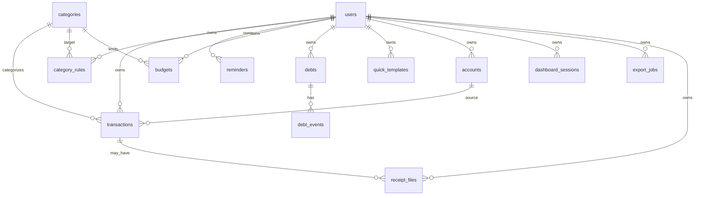

# 05_database_schema.md — Схема базы данных Finance Telegram Bot

**Версия:** 1.0
**Дата:** 04.06.2026
**Статус:** Draft
**Проект:** Finance Telegram Bot
**Основной стек:** TypeScript, Cloudflare Workers, Hono, Cloudflare D1, Drizzle ORM, Cloudflare KV, Telegram Bot API

---

## Содержание

1. Назначение документа
2. Краткое описание данных проекта
3. Где какие данные хранятся
4. Главные правила проектирования БД
5. Версионирование схемы по продуктовым версиям
6. Нейминг таблиц, колонок и индексов
7. Общие поля для таблиц
8. Типы данных и хранение денег
9. ER-схема базы данных
10. Таблица `users`
11. Таблица `categories`
12. Таблица `transactions`
13. Таблица `category_rules`
14. Таблица `reminders`
15. Таблица `processed_updates`
16. Таблица `budgets`
17. Таблица `debts`
18. Таблица `debt_events`
19. Таблица `quick_templates`
20. Таблица `accounts`
21. Таблица `dashboard_sessions`
22. Таблица `export_jobs`
23. Таблица `receipt_files`
24. Таблица `user_feature_flags`
25. Полная SQL-схема MVP
26. SQL-схема версии 1.1
27. SQL-схема версии 2.0
28. SQL-схема версии 3.0
29. Индексы
30. Soft delete rules
31. Foreign keys и ограничения
32. Seed системных категорий
33. Примеры SQL-запросов
34. Drizzle ORM schema
35. Repository rules
36. Миграции D1
37. Удаление данных пользователя
38. Backup/export considerations
39. Типичные ошибки в схеме
40. Чеклист готовности database-блока

---

## 1. Назначение документа

Этот документ описывает полную схему базы данных проекта **Finance Telegram Bot**.

Документ нужен для:

* создания D1 database;
* написания миграций;
* реализации Drizzle schema;
* построения repository layer;
* реализации отчётов;
* реализации soft delete;
* защиты пользовательских данных;
* подготовки будущих версий: бюджеты, долги, dashboard, export, AI/OCR.

Документ самодостаточный. Разработчик может создать базу данных и начать реализацию backend-модулей без обращения к другим документам.

---

## 2. Краткое описание данных проекта

Finance Telegram Bot хранит личные финансовые данные пользователя.

Основные данные MVP:

* пользователи;
* категории;
* транзакции;
* пользовательские правила категоризации;
* напоминания;
* обработанные Telegram updates для идемпотентности.

Пример пользовательского сообщения:

```text
35 обед
```

После обработки в базе появляется транзакция:

```text
type: expense
amount_minor: 3500
currency: TJS
category: food
note: обед
transaction_date: 2026-06-04
```

Пример дохода:

```text
+300 зарплата
```

После обработки:

```text
type: income
amount_minor: 30000
currency: TJS
category: income
note: зарплата
transaction_date: 2026-06-04
```

---

## 3. Где какие данные хранятся

В проекте есть два основных хранилища:

1. **Cloudflare D1** — постоянные данные.
2. **Cloudflare KV** — временные данные.

---

### 3.1 Cloudflare D1

D1 является источником истины для постоянных данных.

В D1 хранятся:

```text
users
categories
transactions
category_rules
reminders
processed_updates
budgets
debts
debt_events
quick_templates
accounts
dashboard_sessions
export_jobs
receipt_files
user_feature_flags
```

D1 используется для:

* финансовых операций;
* отчётов;
* истории;
* экспорта;
* пользовательских настроек;
* бюджетов;
* долгов;
* dashboard API.

---

### 3.2 Cloudflare KV

KV используется только для временных данных.

В KV хранятся:

```text
state:{telegram_id}
rate_limit:{telegram_id}:{minute_bucket}
callback_lock:{callback_id}
reminder_sent:{user_id}:{date}:{type}
dashboard_login:{token}
```

KV не должен быть источником истины для финансовых данных.

Нельзя хранить в KV:

```text
transactions
balances
monthly reports as source of truth
debts
budgets
categories
```

---

### 3.3 Почему `processed_updates` есть и в D1, если overview предлагал KV

В базовом overview идемпотентность описана через KV:

```text
processed_update:{update_id}
```

Для MVP это допустимо. Но для финансовых операций лучше иметь более строгую защиту от дублей через D1 unique constraint.

> 💡 Дополнено: добавлена таблица `processed_updates`, потому что для финансового бота важно не создать повторную транзакцию при повторной доставке Telegram update. KV-подход удобен, но D1 с `PRIMARY KEY` по `update_id` надёжнее для production-hardening.

Рекомендация:

* MVP может начать с KV;
* production-ready MVP должен использовать D1 `processed_updates`;
* KV можно оставить как быстрый short-term cache.

---

## 4. Главные правила проектирования БД

### 4.1 Все пользовательские данные привязаны к `user_id`

Любая таблица, содержащая личные данные, должна иметь:

```sql
user_id TEXT NOT NULL
```

Примеры:

```text
transactions.user_id
category_rules.user_id
budgets.user_id
debts.user_id
accounts.user_id
```

---

### 4.2 Нельзя читать данные без `user_id`

Запрещённый запрос:

```sql
SELECT * FROM transactions;
```

Правильный запрос:

```sql
SELECT *
FROM transactions
WHERE user_id = ?
  AND deleted_at IS NULL;
```

---

### 4.3 Транзакции удаляются через soft delete

Таблица `transactions` не должна физически удалять записи при обычном удалении пользователем.

Вместо этого заполняется:

```sql
deleted_at TEXT
```

Активная запись:

```text
deleted_at = NULL
```

Удалённая запись:

```text
deleted_at = '2026-06-04T12:00:00.000Z'
```

---

### 4.4 Дата операции и дата создания — разные поля

Нужно различать:

```text
transaction_date — когда произошла операция
created_at       — когда запись добавлена в бот
```

Пример:

Пользователь 4 июня пишет:

```text
вчера 50 кофе
```

В базе:

```text
transaction_date = 2026-06-03
created_at       = 2026-06-04T12:00:00.000Z
```

---

### 4.5 Финансовые суммы хранятся как integer minor units

Вместо `amount REAL` рекомендуется хранить:

```sql
amount_minor INTEGER NOT NULL
```

Примеры:

```text
35 TJS     → 3500
35.50 TJS  → 3550
300 USD    → 30000
```

В MVP можно показывать пользователю сумму как `35 TJS`, но в базе хранить `3500`.

> 💡 Дополнено: в overview использовался `amount REAL`. Для финансовой системы безопаснее хранить деньги в minor units, чтобы избежать ошибок округления при суммировании.

---

### 4.6 Все timestamps хранятся как ISO string

Формат:

```text
2026-06-04T12:00:00.000Z
```

Для дат отчётов используется отдельный формат:

```text
2026-06-04
```

Рекомендация:

* `created_at`, `updated_at`, `deleted_at`, `closed_at` — ISO datetime UTC;
* `transaction_date`, `start_date`, `end_date` — ISO date.

---

## 5. Версионирование схемы по продуктовым версиям

### 5.1 MVP / версия 1.0

Обязательные таблицы:

```text
users
categories
transactions
category_rules
reminders
processed_updates
```

---

### 5.2 Версия 1.1

Добавляются:

```text
budgets
debts
debt_events
quick_templates
```

---

### 5.3 Версия 2.0

Добавляются:

```text
accounts
dashboard_sessions
export_jobs
```

---

### 5.4 Версия 3.0

Добавляются:

```text
receipt_files
user_feature_flags
```

Также могут быть добавлены таблицы для:

```text
subscriptions
family_workspaces
workspace_members
ai_categorization_logs
```

Эти таблицы не входят в текущую обязательную схему, потому что требуют отдельного документа по монетизации и multi-user режиму.

> 💡 Дополнено: версии 2.0 и 3.0 требуют будущих таблиц, которых нет в overview в полном виде. Они добавлены как архитектурная подготовка, но MVP не должен их реализовывать.

---

## 6. Нейминг таблиц, колонок и индексов

### 6.1 Таблицы

Используем `snake_case`, plural nouns:

```text
users
categories
transactions
category_rules
processed_updates
```

---

### 6.2 Колонки

Используем `snake_case`:

```text
telegram_id
user_id
category_id
amount_minor
transaction_date
created_at
updated_at
deleted_at
```

---

### 6.3 Индексы

Формат:

```text
idx_{table}_{columns}
```

Примеры:

```text
idx_transactions_user_date
idx_transactions_user_category
idx_category_rules_user_keyword
```

---

### 6.4 Unique indexes

Формат:

```text
uq_{table}_{columns}
```

Примеры:

```text
uq_users_telegram_id
uq_categories_user_code_type
```

---

### 6.5 Foreign keys

Формат:

```text
fk_{table}_{column}_{referenced_table}
```

D1/SQLite не требует явного имени constraint во всех сценариях, но в SQL-комментариях и миграциях нужно придерживаться такого нейминга.

---

## 7. Общие поля для таблиц

Большинство таблиц должны иметь:

```sql
id TEXT PRIMARY KEY
created_at TEXT NOT NULL
updated_at TEXT NOT NULL
```

Таблицы с soft delete также имеют:

```sql
deleted_at TEXT
```

---

### 7.1 `id`

Тип:

```sql
TEXT PRIMARY KEY
```

Формат ID:

```text
UUID v4
```

Пример:

```text
d01d7c98-b0e6-4d2a-b1ef-f74d4f4e7e3f
```

Почему не integer autoincrement:

* проще генерировать ID в application layer;
* безопаснее для future sync/export;
* удобно для callback actions;
* не раскрывает количество записей.

---

### 7.2 `created_at`

Когда запись создана.

Формат:

```text
2026-06-04T12:00:00.000Z
```

---

### 7.3 `updated_at`

Когда запись обновлена.

При insert:

```text
updated_at = created_at
```

При update:

```text
updated_at = now
```

---

### 7.4 `deleted_at`

Используется для soft delete.

Если запись активна:

```text
NULL
```

Если запись удалена:

```text
2026-06-04T12:00:00.000Z
```

---

## 8. Типы данных и хранение денег

### 8.1 Основные типы D1/SQLite

Используем:

| Тип       | Для чего                              |
| --------- | ------------------------------------- |
| `TEXT`    | ID, даты, строки, enum-like значения  |
| `INTEGER` | boolean flags, amount_minor, counters |
| `REAL`    | нежелательно для денег                |
| `BLOB`    | не используется в MVP                 |

---

### 8.2 Boolean values

SQLite/D1 не имеет отдельного boolean-типа как PostgreSQL.

Используем:

```sql
INTEGER NOT NULL DEFAULT 0
```

Значения:

```text
0 = false
1 = true
```

Примеры:

```sql
is_default INTEGER NOT NULL DEFAULT 0
is_active INTEGER NOT NULL DEFAULT 1
```

---

### 8.3 Enum values

Enum-like поля хранятся как `TEXT` + `CHECK`.

Пример:

```sql
type TEXT NOT NULL CHECK (type IN ('expense', 'income'))
```

---

### 8.4 Деньги

Используем:

```sql
amount_minor INTEGER NOT NULL CHECK (amount_minor > 0)
currency TEXT NOT NULL DEFAULT 'TJS'
```

Примеры:

| Пользовательский ввод | `amount_minor` | `currency` |
| --------------------- | -------------: | ---------- |
| `35 обед`             |         `3500` | `TJS`      |
| `35.5 кофе`           |         `3550` | `TJS`      |
| `+300 зарплата`       |        `30000` | `TJS`      |

---

### 8.5 Форматирование денег

В application layer:

```typescript
export function formatMoney(amountMinor: number, currency: string): string {
  const amount = amountMinor / 100;

  return `${amount.toLocaleString('ru-RU', {
    minimumFractionDigits: Number.isInteger(amount) ? 0 : 2,
    maximumFractionDigits: 2,
  })} ${currency}`;
}
```

---

### 8.6 Конвертация пользовательского ввода

```typescript
export function toMinorUnits(amount: number): number {
  return Math.round(amount * 100);
}
```

Пример:

```typescript
toMinorUnits(35);    // 3500
toMinorUnits(35.5);  // 3550
```

---

## 9. ER-схема базы данных



---

## 10. Таблица `users`

### 10.1 Назначение

Хранит пользователей Telegram-бота.

Один Telegram account соответствует одному пользователю системы.

---

### 10.2 Поля

| Колонка                   | Тип    | Null | Описание                       |
| ------------------------- | ------ | ---: | ------------------------------ |
| `id`                      | `TEXT` |   No | Internal user ID               |
| `telegram_id`             | `TEXT` |   No | Telegram user ID               |
| `telegram_chat_id`        | `TEXT` |   No | Chat ID для отправки сообщений |
| `first_name`              | `TEXT` |  Yes | Telegram first name            |
| `last_name`               | `TEXT` |  Yes | Telegram last name             |
| `username`                | `TEXT` |  Yes | Telegram username              |
| `currency`                | `TEXT` |   No | Основная валюта                |
| `timezone`                | `TEXT` |   No | Часовой пояс                   |
| `language`                | `TEXT` |   No | Язык интерфейса                |
| `onboarding_completed_at` | `TEXT` |  Yes | Дата завершения онбординга     |
| `created_at`              | `TEXT` |   No | Дата создания                  |
| `updated_at`              | `TEXT` |   No | Дата обновления                |
| `deleted_at`              | `TEXT` |  Yes | Soft delete / account deletion |

---

### 10.3 SQL

```sql
CREATE TABLE users (
  id TEXT PRIMARY KEY,
  telegram_id TEXT NOT NULL,
  telegram_chat_id TEXT NOT NULL,
  first_name TEXT,
  last_name TEXT,
  username TEXT,
  currency TEXT NOT NULL DEFAULT 'TJS',
  timezone TEXT NOT NULL DEFAULT 'Asia/Dushanbe',
  language TEXT NOT NULL DEFAULT 'ru',
  onboarding_completed_at TEXT,
  created_at TEXT NOT NULL,
  updated_at TEXT NOT NULL,
  deleted_at TEXT
);

CREATE UNIQUE INDEX uq_users_telegram_id
  ON users(telegram_id)
  WHERE deleted_at IS NULL;

CREATE INDEX idx_users_deleted_at
  ON users(deleted_at);
```

---

### 10.4 Правила

1. `telegram_id` уникален среди активных пользователей.
2. `telegram_chat_id` нужен для отправки cron reminders.
3. При `/start` пользователь создаётся, если его нет.
4. Повторный `/start` не создаёт нового пользователя.
5. При `/delete_my_data` можно физически удалить пользователя и все связанные данные или soft-delete пользователя после удаления финансовых данных.

---

## 11. Таблица `categories`

### 11.1 Назначение

Хранит системные и пользовательские категории.

Системные категории:

```text
user_id = NULL
is_default = 1
```

Пользовательские категории:

```text
user_id = current user id
is_default = 0
```

---

### 11.2 Поля

| Колонка      | Тип       | Null | Описание                     |
| ------------ | --------- | ---: | ---------------------------- |
| `id`         | `TEXT`    |   No | Category ID                  |
| `user_id`    | `TEXT`    |  Yes | NULL для системных категорий |
| `code`       | `TEXT`    |   No | Machine-readable code        |
| `name`       | `TEXT`    |   No | Название для пользователя    |
| `type`       | `TEXT`    |   No | `expense` или `income`       |
| `icon`       | `TEXT`    |  Yes | Emoji/icon                   |
| `is_default` | `INTEGER` |   No | 1 для системных категорий    |
| `sort_order` | `INTEGER` |   No | Порядок отображения          |
| `created_at` | `TEXT`    |   No | Дата создания                |
| `updated_at` | `TEXT`    |   No | Дата обновления              |
| `deleted_at` | `TEXT`    |  Yes | Soft delete                  |

---

### 11.3 SQL

```sql
CREATE TABLE categories (
  id TEXT PRIMARY KEY,
  user_id TEXT,
  code TEXT NOT NULL,
  name TEXT NOT NULL,
  type TEXT NOT NULL CHECK (type IN ('expense', 'income')),
  icon TEXT,
  is_default INTEGER NOT NULL DEFAULT 0,
  sort_order INTEGER NOT NULL DEFAULT 100,
  created_at TEXT NOT NULL,
  updated_at TEXT NOT NULL,
  deleted_at TEXT,
  FOREIGN KEY (user_id) REFERENCES users(id)
);

CREATE INDEX idx_categories_user
  ON categories(user_id)
  WHERE deleted_at IS NULL;

CREATE INDEX idx_categories_type
  ON categories(type)
  WHERE deleted_at IS NULL;

CREATE UNIQUE INDEX uq_categories_default_code_type
  ON categories(code, type)
  WHERE user_id IS NULL AND deleted_at IS NULL;

CREATE UNIQUE INDEX uq_categories_user_code_type
  ON categories(user_id, code, type)
  WHERE user_id IS NOT NULL AND deleted_at IS NULL;
```

---

### 11.4 Правила

1. Системные категории нельзя удалять пользовательскими командами.
2. Пользовательские категории доступны только владельцу.
3. Системная категория `other` должна существовать всегда.
4. Системная категория `income` должна существовать всегда.
5. В отчётах показывается `categories.name`.
6. В parser используется `categories.code`.

---

## 12. Таблица `transactions`

### 12.1 Назначение

Главная таблица финансовых операций.

Хранит:

* расходы;
* доходы;
* комментарии;
* дату операции;
* категорию;
* валюту;
* ссылку на счёт в версии 2.0;
* soft delete status.

---

### 12.2 Поля

| Колонка              | Тип       | Null | Описание                                           |
| -------------------- | --------- | ---: | -------------------------------------------------- |
| `id`                 | `TEXT`    |   No | Transaction ID                                     |
| `user_id`            | `TEXT`    |   No | Владелец операции                                  |
| `category_id`        | `TEXT`    |  Yes | Категория                                          |
| `account_id`         | `TEXT`    |  Yes | Счёт, версия 2.0                                   |
| `type`               | `TEXT`    |   No | `expense` или `income`                             |
| `amount_minor`       | `INTEGER` |   No | Сумма в minor units                                |
| `currency`           | `TEXT`    |   No | Валюта                                             |
| `note`               | `TEXT`    |  Yes | Комментарий                                        |
| `source`             | `TEXT`    |   No | Источник: `telegram`, `dashboard`, `import`, `ocr` |
| `telegram_update_id` | `TEXT`    |  Yes | Telegram update ID                                 |
| `transaction_date`   | `TEXT`    |   No | Дата операции: `YYYY-MM-DD`                        |
| `created_at`         | `TEXT`    |   No | Дата создания                                      |
| `updated_at`         | `TEXT`    |   No | Дата обновления                                    |
| `deleted_at`         | `TEXT`    |  Yes | Soft delete                                        |

---

### 12.3 SQL

```sql
CREATE TABLE transactions (
  id TEXT PRIMARY KEY,
  user_id TEXT NOT NULL,
  category_id TEXT,
  account_id TEXT,
  type TEXT NOT NULL CHECK (type IN ('expense', 'income')),
  amount_minor INTEGER NOT NULL CHECK (amount_minor > 0),
  currency TEXT NOT NULL DEFAULT 'TJS',
  note TEXT,
  source TEXT NOT NULL DEFAULT 'telegram'
    CHECK (source IN ('telegram', 'dashboard', 'import', 'ocr')),
  telegram_update_id TEXT,
  transaction_date TEXT NOT NULL,
  created_at TEXT NOT NULL,
  updated_at TEXT NOT NULL,
  deleted_at TEXT,
  FOREIGN KEY (user_id) REFERENCES users(id),
  FOREIGN KEY (category_id) REFERENCES categories(id)
);
```

---

### 12.4 Правила

1. `amount_minor` всегда положительный.
2. Тип операции хранится отдельно в `type`.
3. Доход не хранится как отрицательный расход.
4. Расход не хранится как отрицательная сумма.
5. `transaction_date` используется для отчётов.
6. `created_at` используется для истории и `/delete_last`.
7. `deleted_at IS NULL` означает активную операцию.
8. Все отчёты игнорируют `deleted_at IS NOT NULL`.

---

### 12.5 Почему доходы и расходы в одной таблице

Это упрощает:

* баланс;
* отчёты;
* историю;
* экспорт;
* фильтрацию по периоду;
* soft delete;
* dashboard.

Пример расчёта:

```sql
SELECT
  SUM(CASE WHEN type = 'income' THEN amount_minor ELSE 0 END) AS income_minor,
  SUM(CASE WHEN type = 'expense' THEN amount_minor ELSE 0 END) AS expense_minor
FROM transactions
WHERE user_id = ?
  AND transaction_date >= ?
  AND transaction_date < ?
  AND deleted_at IS NULL;
```

---

## 13. Таблица `category_rules`

### 13.1 Назначение

Хранит пользовательские правила автокатегоризации.

Пример:

```text
keyword: такси
category: Работа
user_id: current user
```

Если пользователь исправил категорию, правило применяется в будущем.

---

### 13.2 Поля

| Колонка       | Тип       | Null | Описание                           |
| ------------- | --------- | ---: | ---------------------------------- |
| `id`          | `TEXT`    |   No | Rule ID                            |
| `user_id`     | `TEXT`    |   No | Владелец правила                   |
| `keyword`     | `TEXT`    |   No | Нормализованное ключевое слово     |
| `category_id` | `TEXT`    |   No | Целевая категория                  |
| `match_type`  | `TEXT`    |   No | `contains`, `exact`, `starts_with` |
| `priority`    | `INTEGER` |   No | Приоритет                          |
| `created_at`  | `TEXT`    |   No | Дата создания                      |
| `updated_at`  | `TEXT`    |   No | Дата обновления                    |
| `deleted_at`  | `TEXT`    |  Yes | Soft delete                        |

---

### 13.3 SQL

```sql
CREATE TABLE category_rules (
  id TEXT PRIMARY KEY,
  user_id TEXT NOT NULL,
  keyword TEXT NOT NULL,
  category_id TEXT NOT NULL,
  match_type TEXT NOT NULL DEFAULT 'contains'
    CHECK (match_type IN ('contains', 'exact', 'starts_with')),
  priority INTEGER NOT NULL DEFAULT 100,
  created_at TEXT NOT NULL,
  updated_at TEXT NOT NULL,
  deleted_at TEXT,
  FOREIGN KEY (user_id) REFERENCES users(id),
  FOREIGN KEY (category_id) REFERENCES categories(id)
);

CREATE INDEX idx_category_rules_user_keyword
  ON category_rules(user_id, keyword)
  WHERE deleted_at IS NULL;

CREATE INDEX idx_category_rules_user_priority
  ON category_rules(user_id, priority)
  WHERE deleted_at IS NULL;

CREATE UNIQUE INDEX uq_category_rules_user_keyword_match
  ON category_rules(user_id, keyword, match_type)
  WHERE deleted_at IS NULL;
```

---

### 13.4 Правила

1. Пользовательское правило имеет приоритет над системным словарём.
2. Правило применяется только для одного пользователя.
3. `keyword` должен храниться в normalized lowercase form.
4. При изменении правила старое можно обновить или soft-delete.
5. Если категория удалена, правила на неё должны быть отключены или переназначены.

---

## 14. Таблица `reminders`

### 14.1 Назначение

Хранит настройки напоминаний.

MVP:

* ежедневное напоминание записать расходы.

Версия 1.1:

* недельный автоотчёт;
* месячный автоотчёт.

---

### 14.2 Поля

| Колонка          | Тип       | Null | Описание                                   |
| ---------------- | --------- | ---: | ------------------------------------------ |
| `id`             | `TEXT`    |   No | Reminder ID                                |
| `user_id`        | `TEXT`    |   No | Владелец                                   |
| `type`           | `TEXT`    |   No | `daily`, `weekly_report`, `monthly_report` |
| `time_local`     | `TEXT`    |   No | Время пользователя: `20:00`                |
| `day_of_week`    | `INTEGER` |  Yes | 1-7 для weekly                             |
| `day_of_month`   | `INTEGER` |  Yes | 1-31 для monthly                           |
| `timezone`       | `TEXT`    |   No | Timezone                                   |
| `is_active`      | `INTEGER` |   No | 1/0                                        |
| `last_sent_date` | `TEXT`    |  Yes | Последняя дата отправки                    |
| `created_at`     | `TEXT`    |   No | Дата создания                              |
| `updated_at`     | `TEXT`    |   No | Дата обновления                            |

---

### 14.3 SQL

```sql
CREATE TABLE reminders (
  id TEXT PRIMARY KEY,
  user_id TEXT NOT NULL,
  type TEXT NOT NULL CHECK (type IN ('daily', 'weekly_report', 'monthly_report')),
  time_local TEXT NOT NULL DEFAULT '20:00',
  day_of_week INTEGER,
  day_of_month INTEGER,
  timezone TEXT NOT NULL DEFAULT 'Asia/Dushanbe',
  is_active INTEGER NOT NULL DEFAULT 1,
  last_sent_date TEXT,
  created_at TEXT NOT NULL,
  updated_at TEXT NOT NULL,
  FOREIGN KEY (user_id) REFERENCES users(id)
);

CREATE INDEX idx_reminders_active_type
  ON reminders(is_active, type);

CREATE INDEX idx_reminders_user
  ON reminders(user_id);
```

---

### 14.4 Почему не `cron_expression` как основное поле

В overview использовалось:

```text
cron_expression
```

Но у каждого пользователя может быть свой timezone. Для пользовательских напоминаний проще хранить:

```text
time_local
timezone
day_of_week
day_of_month
```

А Worker Cron может запускаться каждые 15 минут и проверять, кому сейчас нужно отправить напоминание.

> 💡 Дополнено: заменён основной подход с `cron_expression` на `time_local + timezone`, потому что пользовательские timezone сложнее корректно обрабатывать через один cron expression на всех.

---

## 15. Таблица `processed_updates`

### 15.1 Назначение

Защита от повторной обработки Telegram update.

Telegram может прислать один и тот же `update_id` повторно. Если это не обработать, бот может создать дубль транзакции.

---

### 15.2 Поля

| Колонка                  | Тип    | Null | Описание                            |
| ------------------------ | ------ | ---: | ----------------------------------- |
| `update_id`              | `TEXT` |   No | Telegram update ID                  |
| `user_id`                | `TEXT` |  Yes | User ID, если известен              |
| `status`                 | `TEXT` |   No | `processing`, `processed`, `failed` |
| `created_transaction_id` | `TEXT` |  Yes | ID созданной транзакции             |
| `created_at`             | `TEXT` |   No | Дата получения                      |
| `processed_at`           | `TEXT` |  Yes | Дата успешной обработки             |

---

### 15.3 SQL

```sql
CREATE TABLE processed_updates (
  update_id TEXT PRIMARY KEY,
  user_id TEXT,
  status TEXT NOT NULL CHECK (status IN ('processing', 'processed', 'failed')),
  created_transaction_id TEXT,
  created_at TEXT NOT NULL,
  processed_at TEXT,
  FOREIGN KEY (user_id) REFERENCES users(id),
  FOREIGN KEY (created_transaction_id) REFERENCES transactions(id)
);

CREATE INDEX idx_processed_updates_user
  ON processed_updates(user_id);

CREATE INDEX idx_processed_updates_created_at
  ON processed_updates(created_at);
```

---

### 15.4 Правила

1. Перед обработкой update нужно попытаться вставить `update_id`.
2. Если insert падает из-за duplicate primary key — update уже был принят.
3. Если обработка успешна — status меняется на `processed`.
4. Если возникла ошибка — status можно оставить `failed`.
5. Старые записи можно чистить scheduled job после 7–30 дней.

---

### 15.5 Idempotency insert pattern

```sql
INSERT INTO processed_updates (
  update_id,
  user_id,
  status,
  created_at
)
VALUES (?, ?, 'processing', ?);
```

Если `update_id` уже существует, D1 вернёт ошибку unique constraint. В application layer это значит:

```text
duplicate update, skip processing
```

---

## 16. Таблица `budgets`

### 16.1 Назначение

Версия: 1.1.

Хранит бюджеты и лимиты пользователя.

Типы бюджетов:

* общий месячный бюджет;
* бюджет по категории.

---

### 16.2 Поля

| Колонка              | Тип       | Null | Описание            |
| -------------------- | --------- | ---: | ------------------- |
| `id`                 | `TEXT`    |   No | Budget ID           |
| `user_id`            | `TEXT`    |   No | Владелец            |
| `category_id`        | `TEXT`    |  Yes | NULL = общий бюджет |
| `period`             | `TEXT`    |   No | `month`             |
| `limit_amount_minor` | `INTEGER` |   No | Лимит в minor units |
| `currency`           | `TEXT`    |   No | Валюта              |
| `start_date`         | `TEXT`    |   No | Начало периода      |
| `end_date`           | `TEXT`    |   No | Конец периода       |
| `created_at`         | `TEXT`    |   No | Дата создания       |
| `updated_at`         | `TEXT`    |   No | Дата обновления     |
| `deleted_at`         | `TEXT`    |  Yes | Soft delete         |

---

### 16.3 SQL

```sql
CREATE TABLE budgets (
  id TEXT PRIMARY KEY,
  user_id TEXT NOT NULL,
  category_id TEXT,
  period TEXT NOT NULL DEFAULT 'month' CHECK (period IN ('month')),
  limit_amount_minor INTEGER NOT NULL CHECK (limit_amount_minor > 0),
  currency TEXT NOT NULL DEFAULT 'TJS',
  start_date TEXT NOT NULL,
  end_date TEXT NOT NULL,
  created_at TEXT NOT NULL,
  updated_at TEXT NOT NULL,
  deleted_at TEXT,
  FOREIGN KEY (user_id) REFERENCES users(id),
  FOREIGN KEY (category_id) REFERENCES categories(id)
);

CREATE INDEX idx_budgets_user_period
  ON budgets(user_id, start_date, end_date)
  WHERE deleted_at IS NULL;

CREATE INDEX idx_budgets_user_category_period
  ON budgets(user_id, category_id, start_date, end_date)
  WHERE deleted_at IS NULL;
```

---

### 16.4 Правила

1. `category_id = NULL` означает общий бюджет.
2. `category_id IS NOT NULL` означает бюджет по категории.
3. В одном периоде не должно быть двух активных бюджетов для одной категории.
4. При изменении бюджета лучше обновлять текущую запись, а не создавать дубль.

---

## 17. Таблица `debts`

### 17.1 Назначение

Версия: 1.1.

Хранит активные и закрытые долги.

Примеры:

```text
дал Али 100
занял у Фарруха 200
```

---

### 17.2 Поля

| Колонка                  | Тип       | Null | Описание                       |
| ------------------------ | --------- | ---: | ------------------------------ |
| `id`                     | `TEXT`    |   No | Debt ID                        |
| `user_id`                | `TEXT`    |   No | Владелец                       |
| `person_name`            | `TEXT`    |   No | Имя человека                   |
| `direction`              | `TEXT`    |   No | `they_owe_me` или `i_owe_them` |
| `initial_amount_minor`   | `INTEGER` |   No | Начальная сумма                |
| `remaining_amount_minor` | `INTEGER` |   No | Остаток                        |
| `currency`               | `TEXT`    |   No | Валюта                         |
| `status`                 | `TEXT`    |   No | `active`, `closed`             |
| `note`                   | `TEXT`    |  Yes | Комментарий                    |
| `created_at`             | `TEXT`    |   No | Дата создания                  |
| `updated_at`             | `TEXT`    |   No | Дата обновления                |
| `closed_at`              | `TEXT`    |  Yes | Дата закрытия                  |
| `deleted_at`             | `TEXT`    |  Yes | Soft delete                    |

---

### 17.3 SQL

```sql
CREATE TABLE debts (
  id TEXT PRIMARY KEY,
  user_id TEXT NOT NULL,
  person_name TEXT NOT NULL,
  direction TEXT NOT NULL CHECK (direction IN ('they_owe_me', 'i_owe_them')),
  initial_amount_minor INTEGER NOT NULL CHECK (initial_amount_minor > 0),
  remaining_amount_minor INTEGER NOT NULL CHECK (remaining_amount_minor >= 0),
  currency TEXT NOT NULL DEFAULT 'TJS',
  status TEXT NOT NULL DEFAULT 'active' CHECK (status IN ('active', 'closed')),
  note TEXT,
  created_at TEXT NOT NULL,
  updated_at TEXT NOT NULL,
  closed_at TEXT,
  deleted_at TEXT,
  FOREIGN KEY (user_id) REFERENCES users(id)
);

CREATE INDEX idx_debts_user_status
  ON debts(user_id, status)
  WHERE deleted_at IS NULL;

CREATE INDEX idx_debts_user_person
  ON debts(user_id, person_name)
  WHERE deleted_at IS NULL;
```

---

### 17.4 Правила

1. `remaining_amount_minor` не может быть меньше 0.
2. Если `remaining_amount_minor = 0`, status должен стать `closed`.
3. Закрытые долги не показываются в `/debts` по умолчанию.
4. Удалённые долги не участвуют в отчётах долгов.

---

## 18. Таблица `debt_events`

### 18.1 Назначение

Версия: 1.1.

Хранит историю изменений долга.

Пример:

1. Пользователь дал Али 100.
2. Али вернул 50.
3. Али вернул ещё 50.

В `debts` хранится текущее состояние, а в `debt_events` — история.

> 💡 Дополнено: в overview была таблица `debts`, но не было истории событий. Для долгов лучше хранить события отдельно, чтобы понимать, почему остаток изменился.

---

### 18.2 Поля

| Колонка        | Тип       | Null | Описание                                       |
| -------------- | --------- | ---: | ---------------------------------------------- |
| `id`           | `TEXT`    |   No | Event ID                                       |
| `debt_id`      | `TEXT`    |   No | Debt ID                                        |
| `user_id`      | `TEXT`    |   No | Владелец                                       |
| `type`         | `TEXT`    |   No | `created`, `repayment`, `adjustment`, `closed` |
| `amount_minor` | `INTEGER` |   No | Сумма события                                  |
| `note`         | `TEXT`    |  Yes | Комментарий                                    |
| `created_at`   | `TEXT`    |   No | Дата события                                   |

---

### 18.3 SQL

```sql
CREATE TABLE debt_events (
  id TEXT PRIMARY KEY,
  debt_id TEXT NOT NULL,
  user_id TEXT NOT NULL,
  type TEXT NOT NULL CHECK (type IN ('created', 'repayment', 'adjustment', 'closed')),
  amount_minor INTEGER NOT NULL CHECK (amount_minor >= 0),
  note TEXT,
  created_at TEXT NOT NULL,
  FOREIGN KEY (debt_id) REFERENCES debts(id),
  FOREIGN KEY (user_id) REFERENCES users(id)
);

CREATE INDEX idx_debt_events_debt
  ON debt_events(debt_id);

CREATE INDEX idx_debt_events_user_created
  ON debt_events(user_id, created_at);
```

---

## 19. Таблица `quick_templates`

### 19.1 Назначение

Версия: 1.1.

Хранит быстрые шаблоны расходов.

Пример:

```text
/template lunch 35 обед
```

Потом пользователь пишет:

```text
/lunch
```

И бот создаёт расход:

```text
35 TJS · Еда · обед
```

---

### 19.2 SQL

```sql
CREATE TABLE quick_templates (
  id TEXT PRIMARY KEY,
  user_id TEXT NOT NULL,
  command TEXT NOT NULL,
  type TEXT NOT NULL CHECK (type IN ('expense', 'income')),
  amount_minor INTEGER NOT NULL CHECK (amount_minor > 0),
  currency TEXT NOT NULL DEFAULT 'TJS',
  category_id TEXT,
  note TEXT,
  is_active INTEGER NOT NULL DEFAULT 1,
  created_at TEXT NOT NULL,
  updated_at TEXT NOT NULL,
  deleted_at TEXT,
  FOREIGN KEY (user_id) REFERENCES users(id),
  FOREIGN KEY (category_id) REFERENCES categories(id)
);

CREATE UNIQUE INDEX uq_quick_templates_user_command
  ON quick_templates(user_id, command)
  WHERE deleted_at IS NULL;

CREATE INDEX idx_quick_templates_user_active
  ON quick_templates(user_id, is_active)
  WHERE deleted_at IS NULL;
```

---

## 20. Таблица `accounts`

### 20.1 Назначение

Версия: 2.0.

Хранит счета пользователя:

* cash;
* card;
* bank;
* custom.

Примеры:

```text
наличные
карта
душанбе сити
алиф
```

---

### 20.2 SQL

```sql
CREATE TABLE accounts (
  id TEXT PRIMARY KEY,
  user_id TEXT NOT NULL,
  name TEXT NOT NULL,
  type TEXT NOT NULL DEFAULT 'custom'
    CHECK (type IN ('cash', 'card', 'bank', 'wallet', 'custom')),
  currency TEXT NOT NULL DEFAULT 'TJS',
  initial_balance_minor INTEGER NOT NULL DEFAULT 0,
  is_default INTEGER NOT NULL DEFAULT 0,
  created_at TEXT NOT NULL,
  updated_at TEXT NOT NULL,
  deleted_at TEXT,
  FOREIGN KEY (user_id) REFERENCES users(id)
);

CREATE INDEX idx_accounts_user
  ON accounts(user_id)
  WHERE deleted_at IS NULL;

CREATE UNIQUE INDEX uq_accounts_user_name
  ON accounts(user_id, name)
  WHERE deleted_at IS NULL;
```

---

### 20.3 Связь с `transactions`

В версии 2.0 колонка:

```sql
transactions.account_id
```

начинает использоваться полноценно.

Для MVP она может быть `NULL`.

---

## 21. Таблица `dashboard_sessions`

### 21.1 Назначение

Версия: 2.0.

Хранит сессии web-dashboard.

Пользователь получает temporary login link через Telegram. После входа создаётся dashboard session.

---

### 21.2 SQL

```sql
CREATE TABLE dashboard_sessions (
  id TEXT PRIMARY KEY,
  user_id TEXT NOT NULL,
  token_hash TEXT NOT NULL,
  user_agent TEXT,
  ip_hash TEXT,
  expires_at TEXT NOT NULL,
  revoked_at TEXT,
  created_at TEXT NOT NULL,
  updated_at TEXT NOT NULL,
  FOREIGN KEY (user_id) REFERENCES users(id)
);

CREATE UNIQUE INDEX uq_dashboard_sessions_token_hash
  ON dashboard_sessions(token_hash);

CREATE INDEX idx_dashboard_sessions_user
  ON dashboard_sessions(user_id);

CREATE INDEX idx_dashboard_sessions_expires_at
  ON dashboard_sessions(expires_at);
```

---

### 21.3 Правила

1. Не хранить raw token.
2. Хранить только `token_hash`.
3. Сессия имеет `expires_at`.
4. Logout заполняет `revoked_at`.
5. Dashboard API проверяет session перед каждым запросом.

---

## 22. Таблица `export_jobs`

### 22.1 Назначение

Версия: 2.0.

Хранит историю export-операций.

MVP может генерировать CSV сразу без записи job. Но для dashboard и больших export лучше иметь таблицу.

---

### 22.2 SQL

```sql
CREATE TABLE export_jobs (
  id TEXT PRIMARY KEY,
  user_id TEXT NOT NULL,
  type TEXT NOT NULL CHECK (type IN ('csv', 'xlsx')),
  period_type TEXT NOT NULL CHECK (period_type IN ('month', 'all', 'custom')),
  start_date TEXT,
  end_date TEXT,
  status TEXT NOT NULL DEFAULT 'pending'
    CHECK (status IN ('pending', 'processing', 'completed', 'failed')),
  file_key TEXT,
  file_name TEXT,
  error_code TEXT,
  created_at TEXT NOT NULL,
  updated_at TEXT NOT NULL,
  completed_at TEXT,
  FOREIGN KEY (user_id) REFERENCES users(id)
);

CREATE INDEX idx_export_jobs_user_created
  ON export_jobs(user_id, created_at);

CREATE INDEX idx_export_jobs_status
  ON export_jobs(status);
```

---

## 23. Таблица `receipt_files`

### 23.1 Назначение

Версия: 3.0.

Хранит metadata фото чеков.

Сами файлы должны храниться в R2, а в D1 — только metadata.

---

### 23.2 SQL

```sql
CREATE TABLE receipt_files (
  id TEXT PRIMARY KEY,
  user_id TEXT NOT NULL,
  transaction_id TEXT,
  file_key TEXT NOT NULL,
  original_file_name TEXT,
  mime_type TEXT,
  size_bytes INTEGER,
  ocr_status TEXT NOT NULL DEFAULT 'pending'
    CHECK (ocr_status IN ('pending', 'processing', 'completed', 'failed')),
  ocr_text TEXT,
  parsed_amount_minor INTEGER,
  parsed_date TEXT,
  parsed_category_id TEXT,
  created_at TEXT NOT NULL,
  updated_at TEXT NOT NULL,
  deleted_at TEXT,
  FOREIGN KEY (user_id) REFERENCES users(id),
  FOREIGN KEY (transaction_id) REFERENCES transactions(id),
  FOREIGN KEY (parsed_category_id) REFERENCES categories(id)
);

CREATE INDEX idx_receipt_files_user_created
  ON receipt_files(user_id, created_at)
  WHERE deleted_at IS NULL;

CREATE INDEX idx_receipt_files_transaction
  ON receipt_files(transaction_id)
  WHERE deleted_at IS NULL;
```

---

### 23.3 Правила

1. Не хранить image binary в D1.
2. R2 object key должен включать `user_id`.
3. OCR text может содержать чувствительные данные, поэтому нельзя логировать его.
4. Пользователь должен иметь возможность удалить receipt data.

---

## 24. Таблица `user_feature_flags`

### 24.1 Назначение

Версия: 3.0.

Хранит доступность функций для пользователя.

Примеры:

* AI categorization enabled;
* receipt OCR enabled;
* dashboard enabled;
* export XLSX enabled.

---

### 24.2 SQL

```sql
CREATE TABLE user_feature_flags (
  id TEXT PRIMARY KEY,
  user_id TEXT NOT NULL,
  feature_key TEXT NOT NULL,
  is_enabled INTEGER NOT NULL DEFAULT 0,
  created_at TEXT NOT NULL,
  updated_at TEXT NOT NULL,
  FOREIGN KEY (user_id) REFERENCES users(id)
);

CREATE UNIQUE INDEX uq_user_feature_flags_user_feature
  ON user_feature_flags(user_id, feature_key);
```

---

## 25. Полная SQL-схема MVP

Эта миграция создаёт минимальную базу для версии 1.0.

Файл:

```text
src/db/migrations/0001_initial_mvp.sql
```

```sql
PRAGMA foreign_keys = ON;

CREATE TABLE users (
  id TEXT PRIMARY KEY,
  telegram_id TEXT NOT NULL,
  telegram_chat_id TEXT NOT NULL,
  first_name TEXT,
  last_name TEXT,
  username TEXT,
  currency TEXT NOT NULL DEFAULT 'TJS',
  timezone TEXT NOT NULL DEFAULT 'Asia/Dushanbe',
  language TEXT NOT NULL DEFAULT 'ru',
  onboarding_completed_at TEXT,
  created_at TEXT NOT NULL,
  updated_at TEXT NOT NULL,
  deleted_at TEXT
);

CREATE UNIQUE INDEX uq_users_telegram_id
  ON users(telegram_id)
  WHERE deleted_at IS NULL;

CREATE INDEX idx_users_deleted_at
  ON users(deleted_at);

CREATE TABLE categories (
  id TEXT PRIMARY KEY,
  user_id TEXT,
  code TEXT NOT NULL,
  name TEXT NOT NULL,
  type TEXT NOT NULL CHECK (type IN ('expense', 'income')),
  icon TEXT,
  is_default INTEGER NOT NULL DEFAULT 0,
  sort_order INTEGER NOT NULL DEFAULT 100,
  created_at TEXT NOT NULL,
  updated_at TEXT NOT NULL,
  deleted_at TEXT,
  FOREIGN KEY (user_id) REFERENCES users(id)
);

CREATE INDEX idx_categories_user
  ON categories(user_id)
  WHERE deleted_at IS NULL;

CREATE INDEX idx_categories_type
  ON categories(type)
  WHERE deleted_at IS NULL;

CREATE UNIQUE INDEX uq_categories_default_code_type
  ON categories(code, type)
  WHERE user_id IS NULL AND deleted_at IS NULL;

CREATE UNIQUE INDEX uq_categories_user_code_type
  ON categories(user_id, code, type)
  WHERE user_id IS NOT NULL AND deleted_at IS NULL;

CREATE TABLE transactions (
  id TEXT PRIMARY KEY,
  user_id TEXT NOT NULL,
  category_id TEXT,
  account_id TEXT,
  type TEXT NOT NULL CHECK (type IN ('expense', 'income')),
  amount_minor INTEGER NOT NULL CHECK (amount_minor > 0),
  currency TEXT NOT NULL DEFAULT 'TJS',
  note TEXT,
  source TEXT NOT NULL DEFAULT 'telegram'
    CHECK (source IN ('telegram', 'dashboard', 'import', 'ocr')),
  telegram_update_id TEXT,
  transaction_date TEXT NOT NULL,
  created_at TEXT NOT NULL,
  updated_at TEXT NOT NULL,
  deleted_at TEXT,
  FOREIGN KEY (user_id) REFERENCES users(id),
  FOREIGN KEY (category_id) REFERENCES categories(id)
);

CREATE INDEX idx_transactions_user_date
  ON transactions(user_id, transaction_date)
  WHERE deleted_at IS NULL;

CREATE INDEX idx_transactions_user_category
  ON transactions(user_id, category_id)
  WHERE deleted_at IS NULL;

CREATE INDEX idx_transactions_user_created
  ON transactions(user_id, created_at DESC)
  WHERE deleted_at IS NULL;

CREATE INDEX idx_transactions_user_type_date
  ON transactions(user_id, type, transaction_date)
  WHERE deleted_at IS NULL;

CREATE INDEX idx_transactions_update_id
  ON transactions(telegram_update_id)
  WHERE telegram_update_id IS NOT NULL;

CREATE TABLE category_rules (
  id TEXT PRIMARY KEY,
  user_id TEXT NOT NULL,
  keyword TEXT NOT NULL,
  category_id TEXT NOT NULL,
  match_type TEXT NOT NULL DEFAULT 'contains'
    CHECK (match_type IN ('contains', 'exact', 'starts_with')),
  priority INTEGER NOT NULL DEFAULT 100,
  created_at TEXT NOT NULL,
  updated_at TEXT NOT NULL,
  deleted_at TEXT,
  FOREIGN KEY (user_id) REFERENCES users(id),
  FOREIGN KEY (category_id) REFERENCES categories(id)
);

CREATE INDEX idx_category_rules_user_keyword
  ON category_rules(user_id, keyword)
  WHERE deleted_at IS NULL;

CREATE INDEX idx_category_rules_user_priority
  ON category_rules(user_id, priority)
  WHERE deleted_at IS NULL;

CREATE UNIQUE INDEX uq_category_rules_user_keyword_match
  ON category_rules(user_id, keyword, match_type)
  WHERE deleted_at IS NULL;

CREATE TABLE reminders (
  id TEXT PRIMARY KEY,
  user_id TEXT NOT NULL,
  type TEXT NOT NULL CHECK (type IN ('daily', 'weekly_report', 'monthly_report')),
  time_local TEXT NOT NULL DEFAULT '20:00',
  day_of_week INTEGER,
  day_of_month INTEGER,
  timezone TEXT NOT NULL DEFAULT 'Asia/Dushanbe',
  is_active INTEGER NOT NULL DEFAULT 1,
  last_sent_date TEXT,
  created_at TEXT NOT NULL,
  updated_at TEXT NOT NULL,
  FOREIGN KEY (user_id) REFERENCES users(id)
);

CREATE INDEX idx_reminders_active_type
  ON reminders(is_active, type);

CREATE INDEX idx_reminders_user
  ON reminders(user_id);

CREATE TABLE processed_updates (
  update_id TEXT PRIMARY KEY,
  user_id TEXT,
  status TEXT NOT NULL CHECK (status IN ('processing', 'processed', 'failed')),
  created_transaction_id TEXT,
  created_at TEXT NOT NULL,
  processed_at TEXT,
  FOREIGN KEY (user_id) REFERENCES users(id),
  FOREIGN KEY (created_transaction_id) REFERENCES transactions(id)
);

CREATE INDEX idx_processed_updates_user
  ON processed_updates(user_id);

CREATE INDEX idx_processed_updates_created_at
  ON processed_updates(created_at);
```

---

## 26. SQL-схема версии 1.1

Файл:

```text
src/db/migrations/0002_version_1_1_budgets_debts_templates.sql
```

```sql
CREATE TABLE budgets (
  id TEXT PRIMARY KEY,
  user_id TEXT NOT NULL,
  category_id TEXT,
  period TEXT NOT NULL DEFAULT 'month' CHECK (period IN ('month')),
  limit_amount_minor INTEGER NOT NULL CHECK (limit_amount_minor > 0),
  currency TEXT NOT NULL DEFAULT 'TJS',
  start_date TEXT NOT NULL,
  end_date TEXT NOT NULL,
  created_at TEXT NOT NULL,
  updated_at TEXT NOT NULL,
  deleted_at TEXT,
  FOREIGN KEY (user_id) REFERENCES users(id),
  FOREIGN KEY (category_id) REFERENCES categories(id)
);

CREATE INDEX idx_budgets_user_period
  ON budgets(user_id, start_date, end_date)
  WHERE deleted_at IS NULL;

CREATE INDEX idx_budgets_user_category_period
  ON budgets(user_id, category_id, start_date, end_date)
  WHERE deleted_at IS NULL;

CREATE TABLE debts (
  id TEXT PRIMARY KEY,
  user_id TEXT NOT NULL,
  person_name TEXT NOT NULL,
  direction TEXT NOT NULL CHECK (direction IN ('they_owe_me', 'i_owe_them')),
  initial_amount_minor INTEGER NOT NULL CHECK (initial_amount_minor > 0),
  remaining_amount_minor INTEGER NOT NULL CHECK (remaining_amount_minor >= 0),
  currency TEXT NOT NULL DEFAULT 'TJS',
  status TEXT NOT NULL DEFAULT 'active' CHECK (status IN ('active', 'closed')),
  note TEXT,
  created_at TEXT NOT NULL,
  updated_at TEXT NOT NULL,
  closed_at TEXT,
  deleted_at TEXT,
  FOREIGN KEY (user_id) REFERENCES users(id)
);

CREATE INDEX idx_debts_user_status
  ON debts(user_id, status)
  WHERE deleted_at IS NULL;

CREATE INDEX idx_debts_user_person
  ON debts(user_id, person_name)
  WHERE deleted_at IS NULL;

CREATE TABLE debt_events (
  id TEXT PRIMARY KEY,
  debt_id TEXT NOT NULL,
  user_id TEXT NOT NULL,
  type TEXT NOT NULL CHECK (type IN ('created', 'repayment', 'adjustment', 'closed')),
  amount_minor INTEGER NOT NULL CHECK (amount_minor >= 0),
  note TEXT,
  created_at TEXT NOT NULL,
  FOREIGN KEY (debt_id) REFERENCES debts(id),
  FOREIGN KEY (user_id) REFERENCES users(id)
);

CREATE INDEX idx_debt_events_debt
  ON debt_events(debt_id);

CREATE INDEX idx_debt_events_user_created
  ON debt_events(user_id, created_at);

CREATE TABLE quick_templates (
  id TEXT PRIMARY KEY,
  user_id TEXT NOT NULL,
  command TEXT NOT NULL,
  type TEXT NOT NULL CHECK (type IN ('expense', 'income')),
  amount_minor INTEGER NOT NULL CHECK (amount_minor > 0),
  currency TEXT NOT NULL DEFAULT 'TJS',
  category_id TEXT,
  note TEXT,
  is_active INTEGER NOT NULL DEFAULT 1,
  created_at TEXT NOT NULL,
  updated_at TEXT NOT NULL,
  deleted_at TEXT,
  FOREIGN KEY (user_id) REFERENCES users(id),
  FOREIGN KEY (category_id) REFERENCES categories(id)
);

CREATE UNIQUE INDEX uq_quick_templates_user_command
  ON quick_templates(user_id, command)
  WHERE deleted_at IS NULL;

CREATE INDEX idx_quick_templates_user_active
  ON quick_templates(user_id, is_active)
  WHERE deleted_at IS NULL;
```

---

## 27. SQL-схема версии 2.0

Файл:

```text
src/db/migrations/0003_version_2_0_dashboard_exports_accounts.sql
```

```sql
CREATE TABLE accounts (
  id TEXT PRIMARY KEY,
  user_id TEXT NOT NULL,
  name TEXT NOT NULL,
  type TEXT NOT NULL DEFAULT 'custom'
    CHECK (type IN ('cash', 'card', 'bank', 'wallet', 'custom')),
  currency TEXT NOT NULL DEFAULT 'TJS',
  initial_balance_minor INTEGER NOT NULL DEFAULT 0,
  is_default INTEGER NOT NULL DEFAULT 0,
  created_at TEXT NOT NULL,
  updated_at TEXT NOT NULL,
  deleted_at TEXT,
  FOREIGN KEY (user_id) REFERENCES users(id)
);

CREATE INDEX idx_accounts_user
  ON accounts(user_id)
  WHERE deleted_at IS NULL;

CREATE UNIQUE INDEX uq_accounts_user_name
  ON accounts(user_id, name)
  WHERE deleted_at IS NULL;

CREATE TABLE dashboard_sessions (
  id TEXT PRIMARY KEY,
  user_id TEXT NOT NULL,
  token_hash TEXT NOT NULL,
  user_agent TEXT,
  ip_hash TEXT,
  expires_at TEXT NOT NULL,
  revoked_at TEXT,
  created_at TEXT NOT NULL,
  updated_at TEXT NOT NULL,
  FOREIGN KEY (user_id) REFERENCES users(id)
);

CREATE UNIQUE INDEX uq_dashboard_sessions_token_hash
  ON dashboard_sessions(token_hash);

CREATE INDEX idx_dashboard_sessions_user
  ON dashboard_sessions(user_id);

CREATE INDEX idx_dashboard_sessions_expires_at
  ON dashboard_sessions(expires_at);

CREATE TABLE export_jobs (
  id TEXT PRIMARY KEY,
  user_id TEXT NOT NULL,
  type TEXT NOT NULL CHECK (type IN ('csv', 'xlsx')),
  period_type TEXT NOT NULL CHECK (period_type IN ('month', 'all', 'custom')),
  start_date TEXT,
  end_date TEXT,
  status TEXT NOT NULL DEFAULT 'pending'
    CHECK (status IN ('pending', 'processing', 'completed', 'failed')),
  file_key TEXT,
  file_name TEXT,
  error_code TEXT,
  created_at TEXT NOT NULL,
  updated_at TEXT NOT NULL,
  completed_at TEXT,
  FOREIGN KEY (user_id) REFERENCES users(id)
);

CREATE INDEX idx_export_jobs_user_created
  ON export_jobs(user_id, created_at);

CREATE INDEX idx_export_jobs_status
  ON export_jobs(status);
```

---

## 28. SQL-схема версии 3.0

Файл:

```text
src/db/migrations/0004_version_3_0_receipts_features.sql
```

```sql
CREATE TABLE receipt_files (
  id TEXT PRIMARY KEY,
  user_id TEXT NOT NULL,
  transaction_id TEXT,
  file_key TEXT NOT NULL,
  original_file_name TEXT,
  mime_type TEXT,
  size_bytes INTEGER,
  ocr_status TEXT NOT NULL DEFAULT 'pending'
    CHECK (ocr_status IN ('pending', 'processing', 'completed', 'failed')),
  ocr_text TEXT,
  parsed_amount_minor INTEGER,
  parsed_date TEXT,
  parsed_category_id TEXT,
  created_at TEXT NOT NULL,
  updated_at TEXT NOT NULL,
  deleted_at TEXT,
  FOREIGN KEY (user_id) REFERENCES users(id),
  FOREIGN KEY (transaction_id) REFERENCES transactions(id),
  FOREIGN KEY (parsed_category_id) REFERENCES categories(id)
);

CREATE INDEX idx_receipt_files_user_created
  ON receipt_files(user_id, created_at)
  WHERE deleted_at IS NULL;

CREATE INDEX idx_receipt_files_transaction
  ON receipt_files(transaction_id)
  WHERE deleted_at IS NULL;

CREATE TABLE user_feature_flags (
  id TEXT PRIMARY KEY,
  user_id TEXT NOT NULL,
  feature_key TEXT NOT NULL,
  is_enabled INTEGER NOT NULL DEFAULT 0,
  created_at TEXT NOT NULL,
  updated_at TEXT NOT NULL,
  FOREIGN KEY (user_id) REFERENCES users(id)
);

CREATE UNIQUE INDEX uq_user_feature_flags_user_feature
  ON user_feature_flags(user_id, feature_key);
```

---

## 29. Индексы

### 29.1 Главные индексы MVP

```sql
CREATE INDEX idx_transactions_user_date
  ON transactions(user_id, transaction_date)
  WHERE deleted_at IS NULL;

CREATE INDEX idx_transactions_user_category
  ON transactions(user_id, category_id)
  WHERE deleted_at IS NULL;

CREATE INDEX idx_transactions_user_created
  ON transactions(user_id, created_at DESC)
  WHERE deleted_at IS NULL;

CREATE INDEX idx_transactions_user_type_date
  ON transactions(user_id, type, transaction_date)
  WHERE deleted_at IS NULL;
```

---

### 29.2 Почему нужны индексы

Основные запросы проекта:

* отчёт за день;
* отчёт за неделю;
* отчёт за месяц;
* история последних операций;
* последняя операция для `/delete_last`;
* группировка по категориям.

Все эти запросы фильтруются по:

```text
user_id
transaction_date
deleted_at
category_id
type
created_at
```

Без индексов D1 будет делать больше full scan операций.

---

### 29.3 Индексы по категориям

```sql
CREATE INDEX idx_categories_user
  ON categories(user_id)
  WHERE deleted_at IS NULL;

CREATE INDEX idx_categories_type
  ON categories(type)
  WHERE deleted_at IS NULL;
```

---

### 29.4 Индексы по правилам категоризации

```sql
CREATE INDEX idx_category_rules_user_keyword
  ON category_rules(user_id, keyword)
  WHERE deleted_at IS NULL;
```

---

### 29.5 Индексы по reminders

```sql
CREATE INDEX idx_reminders_active_type
  ON reminders(is_active, type);
```

---

## 30. Soft delete rules

### 30.1 Таблицы с soft delete

Soft delete используют:

```text
users
categories
transactions
category_rules
budgets
debts
quick_templates
accounts
receipt_files
```

---

### 30.2 Таблицы без soft delete

Без soft delete:

```text
processed_updates
debt_events
dashboard_sessions
export_jobs
user_feature_flags
```

Причины:

* `processed_updates` можно чистить по retention policy;
* `debt_events` — audit-like история;
* `dashboard_sessions` имеют `revoked_at`;
* `export_jobs` имеют status;
* `user_feature_flags` можно обновлять напрямую.

---

### 30.3 Главное правило

Все пользовательские запросы к soft-deletable таблицам должны включать:

```sql
deleted_at IS NULL
```

Пример:

```sql
SELECT *
FROM transactions
WHERE user_id = ?
  AND deleted_at IS NULL;
```

---

### 30.4 Soft delete transaction

```sql
UPDATE transactions
SET deleted_at = ?,
    updated_at = ?
WHERE id = ?
  AND user_id = ?
  AND deleted_at IS NULL;
```

---

### 30.5 Нельзя делать

```sql
DELETE FROM transactions WHERE id = ?;
```

Исключение:

* полное удаление данных пользователя через `/delete_my_data`;
* admin maintenance script;
* test cleanup.

---

## 31. Foreign keys и ограничения

### 31.1 Foreign keys

Связи:

```text
transactions.user_id       → users.id
transactions.category_id   → categories.id
category_rules.user_id     → users.id
category_rules.category_id → categories.id
reminders.user_id          → users.id
budgets.user_id            → users.id
budgets.category_id        → categories.id
debts.user_id              → users.id
debt_events.debt_id        → debts.id
```

---

### 31.2 CHECK constraints

Используются для enum-like полей:

```sql
type TEXT NOT NULL CHECK (type IN ('expense', 'income'))
```

```sql
status TEXT NOT NULL CHECK (status IN ('active', 'closed'))
```

---

### 31.3 Amount constraints

```sql
amount_minor INTEGER NOT NULL CHECK (amount_minor > 0)
```

Для долгов:

```sql
remaining_amount_minor INTEGER NOT NULL CHECK (remaining_amount_minor >= 0)
```

---

## 32. Seed системных категорий

### 32.1 Обязательные категории

```text
food
transport
home
communication
entertainment
health
clothing
education
subscriptions
income
other
```

---

### 32.2 SQL seed

Файл:

```text
src/db/migrations/0001_seed_default_categories.sql
```

```sql
INSERT INTO categories (
  id,
  user_id,
  code,
  name,
  type,
  icon,
  is_default,
  sort_order,
  created_at,
  updated_at
)
VALUES
  ('cat_food', NULL, 'food', 'Еда', 'expense', '🍽️', 1, 10, '2026-06-04T00:00:00.000Z', '2026-06-04T00:00:00.000Z'),
  ('cat_transport', NULL, 'transport', 'Транспорт', 'expense', '🚕', 1, 20, '2026-06-04T00:00:00.000Z', '2026-06-04T00:00:00.000Z'),
  ('cat_home', NULL, 'home', 'Дом', 'expense', '🏠', 1, 30, '2026-06-04T00:00:00.000Z', '2026-06-04T00:00:00.000Z'),
  ('cat_communication', NULL, 'communication', 'Связь', 'expense', '📱', 1, 40, '2026-06-04T00:00:00.000Z', '2026-06-04T00:00:00.000Z'),
  ('cat_entertainment', NULL, 'entertainment', 'Развлечения', 'expense', '🎬', 1, 50, '2026-06-04T00:00:00.000Z', '2026-06-04T00:00:00.000Z'),
  ('cat_health', NULL, 'health', 'Здоровье', 'expense', '💊', 1, 60, '2026-06-04T00:00:00.000Z', '2026-06-04T00:00:00.000Z'),
  ('cat_clothing', NULL, 'clothing', 'Одежда', 'expense', '👕', 1, 70, '2026-06-04T00:00:00.000Z', '2026-06-04T00:00:00.000Z'),
  ('cat_education', NULL, 'education', 'Образование', 'expense', '📚', 1, 80, '2026-06-04T00:00:00.000Z', '2026-06-04T00:00:00.000Z'),
  ('cat_subscriptions', NULL, 'subscriptions', 'Подписки', 'expense', '🔁', 1, 90, '2026-06-04T00:00:00.000Z', '2026-06-04T00:00:00.000Z'),
  ('cat_income', NULL, 'income', 'Доход', 'income', '💰', 1, 100, '2026-06-04T00:00:00.000Z', '2026-06-04T00:00:00.000Z'),
  ('cat_other', NULL, 'other', 'Прочее', 'expense', '📦', 1, 999, '2026-06-04T00:00:00.000Z', '2026-06-04T00:00:00.000Z');
```

---

## 33. Примеры SQL-запросов

### 33.1 Найти пользователя по Telegram ID

```sql
SELECT *
FROM users
WHERE telegram_id = ?
  AND deleted_at IS NULL
LIMIT 1;
```

---

### 33.2 Создать транзакцию

```sql
INSERT INTO transactions (
  id,
  user_id,
  category_id,
  type,
  amount_minor,
  currency,
  note,
  source,
  telegram_update_id,
  transaction_date,
  created_at,
  updated_at
)
VALUES (?, ?, ?, ?, ?, ?, ?, 'telegram', ?, ?, ?, ?);
```

---

### 33.3 Последние 10 операций

```sql
SELECT
  t.id,
  t.type,
  t.amount_minor,
  t.currency,
  t.note,
  t.transaction_date,
  t.created_at,
  c.name AS category_name,
  c.icon AS category_icon
FROM transactions t
LEFT JOIN categories c ON c.id = t.category_id
WHERE t.user_id = ?
  AND t.deleted_at IS NULL
ORDER BY t.created_at DESC
LIMIT 10;
```

---

### 33.4 Последняя активная операция

```sql
SELECT *
FROM transactions
WHERE user_id = ?
  AND deleted_at IS NULL
ORDER BY created_at DESC
LIMIT 1;
```

---

### 33.5 Soft delete последней операции

```sql
UPDATE transactions
SET deleted_at = ?,
    updated_at = ?
WHERE id = ?
  AND user_id = ?
  AND deleted_at IS NULL;
```

---

### 33.6 Отчёт за период

```sql
SELECT
  SUM(CASE WHEN type = 'income' THEN amount_minor ELSE 0 END) AS income_minor,
  SUM(CASE WHEN type = 'expense' THEN amount_minor ELSE 0 END) AS expense_minor
FROM transactions
WHERE user_id = ?
  AND transaction_date >= ?
  AND transaction_date < ?
  AND deleted_at IS NULL;
```

---

### 33.7 Расходы по категориям

```sql
SELECT
  COALESCE(c.id, 'uncategorized') AS category_id,
  COALESCE(c.name, 'Без категории') AS category_name,
  COALESCE(c.icon, '') AS category_icon,
  SUM(t.amount_minor) AS total_minor
FROM transactions t
LEFT JOIN categories c ON c.id = t.category_id
WHERE t.user_id = ?
  AND t.type = 'expense'
  AND t.transaction_date >= ?
  AND t.transaction_date < ?
  AND t.deleted_at IS NULL
GROUP BY t.category_id
ORDER BY total_minor DESC;
```

---

### 33.8 Найти пользовательское правило категории

```sql
SELECT *
FROM category_rules
WHERE user_id = ?
  AND deleted_at IS NULL
ORDER BY priority ASC, created_at ASC;
```

Application layer затем проверяет `match_type`.

---

### 33.9 Активные напоминания

```sql
SELECT
  r.*,
  u.telegram_chat_id,
  u.timezone AS user_timezone
FROM reminders r
JOIN users u ON u.id = r.user_id
WHERE r.is_active = 1
  AND u.deleted_at IS NULL;
```

---

### 33.10 Проверить processed update

```sql
SELECT update_id, status
FROM processed_updates
WHERE update_id = ?
LIMIT 1;
```

---

### 33.11 Вставить processed update

```sql
INSERT INTO processed_updates (
  update_id,
  user_id,
  status,
  created_at
)
VALUES (?, ?, 'processing', ?);
```

---

### 33.12 Отметить update обработанным

```sql
UPDATE processed_updates
SET status = 'processed',
    created_transaction_id = ?,
    processed_at = ?
WHERE update_id = ?;
```

---

## 34. Drizzle ORM schema

Файл:

```text
src/db/schema.ts
```

Ниже пример основной части схемы.

---

### 34.1 Imports

```typescript
import {
  sqliteTable,
  text,
  integer,
  index,
  uniqueIndex,
} from 'drizzle-orm/sqlite-core';
import { sql } from 'drizzle-orm';
```

---

### 34.2 `users`

```typescript
export const users = sqliteTable(
  'users',
  {
    id: text('id').primaryKey(),
    telegramId: text('telegram_id').notNull(),
    telegramChatId: text('telegram_chat_id').notNull(),
    firstName: text('first_name'),
    lastName: text('last_name'),
    username: text('username'),
    currency: text('currency').notNull().default('TJS'),
    timezone: text('timezone').notNull().default('Asia/Dushanbe'),
    language: text('language').notNull().default('ru'),
    onboardingCompletedAt: text('onboarding_completed_at'),
    createdAt: text('created_at').notNull(),
    updatedAt: text('updated_at').notNull(),
    deletedAt: text('deleted_at'),
  },
  (table) => ({
    telegramIdUnique: uniqueIndex('uq_users_telegram_id').on(table.telegramId),
    deletedAtIdx: index('idx_users_deleted_at').on(table.deletedAt),
  }),
);
```

---

### 34.3 `categories`

```typescript
export const categories = sqliteTable(
  'categories',
  {
    id: text('id').primaryKey(),
    userId: text('user_id').references(() => users.id),
    code: text('code').notNull(),
    name: text('name').notNull(),
    type: text('type', { enum: ['expense', 'income'] }).notNull(),
    icon: text('icon'),
    isDefault: integer('is_default').notNull().default(0),
    sortOrder: integer('sort_order').notNull().default(100),
    createdAt: text('created_at').notNull(),
    updatedAt: text('updated_at').notNull(),
    deletedAt: text('deleted_at'),
  },
  (table) => ({
    userIdx: index('idx_categories_user').on(table.userId),
    typeIdx: index('idx_categories_type').on(table.type),
  }),
);
```

---

### 34.4 `transactions`

```typescript
export const transactions = sqliteTable(
  'transactions',
  {
    id: text('id').primaryKey(),
    userId: text('user_id')
      .notNull()
      .references(() => users.id),
    categoryId: text('category_id').references(() => categories.id),
    accountId: text('account_id'),
    type: text('type', { enum: ['expense', 'income'] }).notNull(),
    amountMinor: integer('amount_minor').notNull(),
    currency: text('currency').notNull().default('TJS'),
    note: text('note'),
    source: text('source', {
      enum: ['telegram', 'dashboard', 'import', 'ocr'],
    })
      .notNull()
      .default('telegram'),
    telegramUpdateId: text('telegram_update_id'),
    transactionDate: text('transaction_date').notNull(),
    createdAt: text('created_at').notNull(),
    updatedAt: text('updated_at').notNull(),
    deletedAt: text('deleted_at'),
  },
  (table) => ({
    userDateIdx: index('idx_transactions_user_date').on(
      table.userId,
      table.transactionDate,
    ),
    userCategoryIdx: index('idx_transactions_user_category').on(
      table.userId,
      table.categoryId,
    ),
    userCreatedIdx: index('idx_transactions_user_created').on(
      table.userId,
      table.createdAt,
    ),
    userTypeDateIdx: index('idx_transactions_user_type_date').on(
      table.userId,
      table.type,
      table.transactionDate,
    ),
  }),
);
```

---

### 34.5 `category_rules`

```typescript
export const categoryRules = sqliteTable(
  'category_rules',
  {
    id: text('id').primaryKey(),
    userId: text('user_id')
      .notNull()
      .references(() => users.id),
    keyword: text('keyword').notNull(),
    categoryId: text('category_id')
      .notNull()
      .references(() => categories.id),
    matchType: text('match_type', {
      enum: ['contains', 'exact', 'starts_with'],
    })
      .notNull()
      .default('contains'),
    priority: integer('priority').notNull().default(100),
    createdAt: text('created_at').notNull(),
    updatedAt: text('updated_at').notNull(),
    deletedAt: text('deleted_at'),
  },
  (table) => ({
    userKeywordIdx: index('idx_category_rules_user_keyword').on(
      table.userId,
      table.keyword,
    ),
    userPriorityIdx: index('idx_category_rules_user_priority').on(
      table.userId,
      table.priority,
    ),
  }),
);
```

---

### 34.6 `processed_updates`

```typescript
export const processedUpdates = sqliteTable(
  'processed_updates',
  {
    updateId: text('update_id').primaryKey(),
    userId: text('user_id').references(() => users.id),
    status: text('status', {
      enum: ['processing', 'processed', 'failed'],
    }).notNull(),
    createdTransactionId: text('created_transaction_id').references(
      () => transactions.id,
    ),
    createdAt: text('created_at').notNull(),
    processedAt: text('processed_at'),
  },
  (table) => ({
    userIdx: index('idx_processed_updates_user').on(table.userId),
    createdAtIdx: index('idx_processed_updates_created_at').on(table.createdAt),
  }),
);
```

---

### 34.7 Type exports

```typescript
export type User = typeof users.$inferSelect;
export type NewUser = typeof users.$inferInsert;

export type Category = typeof categories.$inferSelect;
export type NewCategory = typeof categories.$inferInsert;

export type Transaction = typeof transactions.$inferSelect;
export type NewTransaction = typeof transactions.$inferInsert;
```

---

## 35. Repository rules

### 35.1 Все repository методы принимают `userId`

Правильно:

```typescript
async findRecentByUserId(userId: string, limit: number) {
  return this.db
    .select()
    .from(transactions)
    .where(
      and(
        eq(transactions.userId, userId),
        isNull(transactions.deletedAt),
      ),
    )
    .orderBy(desc(transactions.createdAt))
    .limit(limit);
}
```

Неправильно:

```typescript
async findRecent(limit: number) {
  return this.db.select().from(transactions).limit(limit);
}
```

---

### 35.2 Soft delete filter обязателен

Каждый метод чтения активных транзакций должен содержать:

```typescript
isNull(transactions.deletedAt)
```

---

### 35.3 Отдельные методы для deleted records

Если нужно прочитать удалённые записи, метод должен называться явно:

```typescript
findDeletedByUserId(...)
findIncludingDeletedById(...)
```

Запрещено скрыто включать удалённые записи в обычные методы.

---

### 35.4 Raw SQL разрешён только в report repository

Для агрегатов raw SQL допустим.

Пример:

```typescript
async getSummaryByPeriod(input: {
  userId: string;
  startDate: string;
  endDate: string;
}) {
  return this.db.run(sql`
    SELECT
      SUM(CASE WHEN type = 'income' THEN amount_minor ELSE 0 END) AS income_minor,
      SUM(CASE WHEN type = 'expense' THEN amount_minor ELSE 0 END) AS expense_minor
    FROM transactions
    WHERE user_id = ${input.userId}
      AND transaction_date >= ${input.startDate}
      AND transaction_date < ${input.endDate}
      AND deleted_at IS NULL
  `);
}
```

---

## 36. Миграции D1

### 36.1 Папка миграций

```text
src/db/migrations/
```

Пример:

```text
0001_initial_mvp.sql
0002_version_1_1_budgets_debts_templates.sql
0003_version_2_0_dashboard_exports_accounts.sql
0004_version_3_0_receipts_features.sql
```

---

### 36.2 Команды

Generate через Drizzle:

```bash
npm run db:generate
```

Apply local:

```bash
npx wrangler d1 migrations apply finance_bot_db --local
```

Apply remote:

```bash
npx wrangler d1 migrations apply finance_bot_db --remote
```

---

### 36.3 Правила миграций

1. Одна миграция — один логический набор изменений.
2. Не редактировать уже применённые remote migrations.
3. Перед remote apply прогонять local migration.
4. После миграции проверять структуру таблиц.
5. Seed системных категорий должен быть idempotent или защищён unique index.

---

### 36.4 Idempotent seed pattern

Если D1/SQLite поддерживает нужный conflict syntax в конкретной версии проекта, можно использовать:

```sql
INSERT OR IGNORE INTO categories (
  id,
  user_id,
  code,
  name,
  type,
  icon,
  is_default,
  sort_order,
  created_at,
  updated_at
)
VALUES
  ('cat_food', NULL, 'food', 'Еда', 'expense', '🍽️', 1, 10, '2026-06-04T00:00:00.000Z', '2026-06-04T00:00:00.000Z');
```

---

## 37. Удаление данных пользователя

### 37.1 Команда `/delete_my_data`

Команда должна полностью удалить данные пользователя после двойного подтверждения.

Удаляемые таблицы:

```text
transactions
category_rules
reminders
budgets
debts
debt_events
quick_templates
accounts
dashboard_sessions
export_jobs
receipt_files
user_feature_flags
users
```

---

### 37.2 Порядок удаления

Сначала дочерние таблицы:

```sql
DELETE FROM receipt_files WHERE user_id = ?;
DELETE FROM export_jobs WHERE user_id = ?;
DELETE FROM dashboard_sessions WHERE user_id = ?;
DELETE FROM quick_templates WHERE user_id = ?;
DELETE FROM debt_events WHERE user_id = ?;
DELETE FROM debts WHERE user_id = ?;
DELETE FROM budgets WHERE user_id = ?;
DELETE FROM reminders WHERE user_id = ?;
DELETE FROM category_rules WHERE user_id = ?;
DELETE FROM transactions WHERE user_id = ?;
DELETE FROM accounts WHERE user_id = ?;
DELETE FROM user_feature_flags WHERE user_id = ?;
DELETE FROM categories WHERE user_id = ?;
DELETE FROM processed_updates WHERE user_id = ?;
DELETE FROM users WHERE id = ?;
```

---

### 37.3 Что не удалять

Не удалять системные категории:

```sql
WHERE user_id IS NULL
```

---

### 37.4 Правило

Обычное удаление операции — soft delete.

Полное удаление данных пользователя — physical delete после двойного подтверждения.

---

## 38. Backup/export considerations

### 38.1 CSV export

MVP export строится из `transactions`.

Запрос:

```sql
SELECT
  t.id,
  t.transaction_date,
  t.type,
  t.amount_minor,
  t.currency,
  c.name AS category,
  t.note,
  t.created_at
FROM transactions t
LEFT JOIN categories c ON c.id = t.category_id
WHERE t.user_id = ?
  AND t.deleted_at IS NULL
ORDER BY t.transaction_date ASC, t.created_at ASC;
```

---

### 38.2 Export amount formatting

В CSV можно отдавать:

```text
amount
```

как decimal string:

```text
35.50
```

И дополнительно:

```text
amount_minor
```

для точности.

Рекомендуемый CSV:

```csv
id,date,type,amount,amount_minor,currency,category,note,created_at
tx_1,2026-06-04,expense,35.00,3500,TJS,Еда,обед,2026-06-04T12:00:00.000Z
```

---

### 38.3 Dashboard export

В версии 2.0 export jobs могут сохранять metadata в `export_jobs`, а сам файл в R2.

---

## 39. Типичные ошибки в схеме

### 39.1 Хранить деньги как `REAL`

Плохо:

```sql
amount REAL NOT NULL
```

Лучше:

```sql
amount_minor INTEGER NOT NULL
```

---

### 39.2 Забыть `deleted_at IS NULL`

Плохо:

```sql
SELECT SUM(amount_minor)
FROM transactions
WHERE user_id = ?;
```

Правильно:

```sql
SELECT SUM(amount_minor)
FROM transactions
WHERE user_id = ?
  AND deleted_at IS NULL;
```

---

### 39.3 Не фильтровать по `user_id`

Плохо:

```sql
SELECT * FROM transactions WHERE id = ?;
```

Правильно:

```sql
SELECT * FROM transactions
WHERE id = ?
  AND user_id = ?;
```

---

### 39.4 Хранить state в D1

Плохо:

```text
dialog_states table for 15-minute states
```

Лучше:

```text
KV: state:{telegram_id}
```

---

### 39.5 Удалять системные категории

Плохо:

```sql
DELETE FROM categories WHERE code = 'food';
```

Системные категории должны быть стабильными.

---

### 39.6 Использовать `created_at` вместо `transaction_date` в отчётах

Плохо:

```sql
WHERE created_at >= ?
```

Правильно:

```sql
WHERE transaction_date >= ?
```

Потому что пользователь может записать расход за вчера.

---

## 40. Чеклист готовности database-блока

Database-блок считается готовым, если выполнены все пункты.

### 40.1 MVP schema

* [ ] Создана таблица `users`.
* [ ] Создана таблица `categories`.
* [ ] Создана таблица `transactions`.
* [ ] Создана таблица `category_rules`.
* [ ] Создана таблица `reminders`.
* [ ] Создана таблица `processed_updates`.
* [ ] Системные категории засеяны.
* [ ] Есть категория `other`.
* [ ] Есть категория `income`.

### 40.2 Money handling

* [ ] Деньги хранятся в `amount_minor`.
* [ ] `amount_minor` всегда положительный.
* [ ] Валюта хранится в `currency`.
* [ ] Есть функции конвертации из decimal в minor units.
* [ ] Есть функции форматирования денег для Telegram.

### 40.3 User isolation

* [ ] Все пользовательские таблицы имеют `user_id`.
* [ ] Все repository методы принимают `userId`.
* [ ] Нет публичных методов чтения financial data без `userId`.
* [ ] Callback operations проверяют ownership через `user_id`.

### 40.4 Soft delete

* [ ] `transactions` имеют `deleted_at`.
* [ ] `/delete_last` делает soft delete.
* [ ] `/history` игнорирует deleted rows.
* [ ] `/today`, `/week`, `/month` игнорируют deleted rows.
* [ ] `/export` игнорирует deleted rows по умолчанию.

### 40.5 Индексы

* [ ] Есть `idx_transactions_user_date`.
* [ ] Есть `idx_transactions_user_category`.
* [ ] Есть `idx_transactions_user_created`.
* [ ] Есть `idx_transactions_user_type_date`.
* [ ] Есть `idx_category_rules_user_keyword`.
* [ ] Есть индексы для reminders.
* [ ] Есть unique index для active `users.telegram_id`.

### 40.6 Idempotency

* [ ] Есть таблица `processed_updates`.
* [ ] `update_id` является primary key.
* [ ] Duplicate update не создаёт дубль транзакции.
* [ ] Update status меняется с `processing` на `processed`.

### 40.7 Drizzle

* [ ] Создан `src/db/schema.ts`.
* [ ] Создан `src/db/client.ts`.
* [ ] Drizzle schema соответствует SQL migration.
* [ ] Экспортированы `$inferSelect` и `$inferInsert` типы.
* [ ] Repository использует Drizzle client.

### 40.8 Миграции

* [ ] Создана миграция `0001_initial_mvp.sql`.
* [ ] Миграция применяется локально.
* [ ] Миграция применяется remote.
* [ ] Seed категорий не создаёт дубли.
* [ ] Не редактируются уже применённые миграции.

### 40.9 Версия 1.1

* [ ] Создана таблица `budgets`.
* [ ] Создана таблица `debts`.
* [ ] Создана таблица `debt_events`.
* [ ] Создана таблица `quick_templates`.

### 40.10 Версия 2.0

* [ ] Создана таблица `accounts`.
* [ ] Создана таблица `dashboard_sessions`.
* [ ] Создана таблица `export_jobs`.

### 40.11 Версия 3.0

* [ ] Создана таблица `receipt_files`.
* [ ] Создана таблица `user_feature_flags`.
* [ ] Receipt binary files не хранятся в D1.
* [ ] OCR text не логируется.

---
